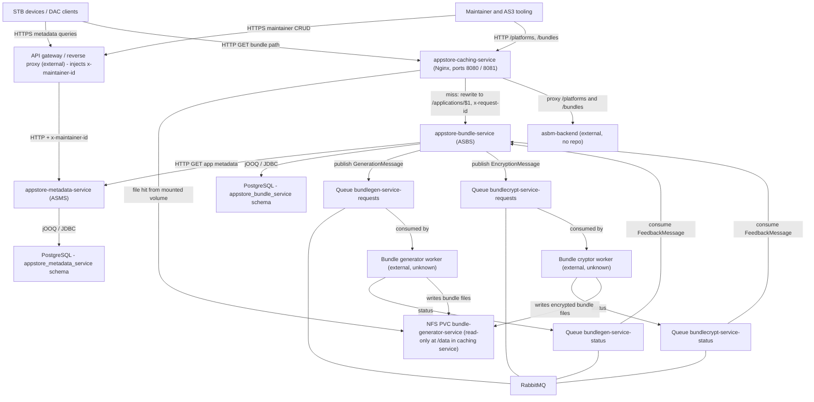
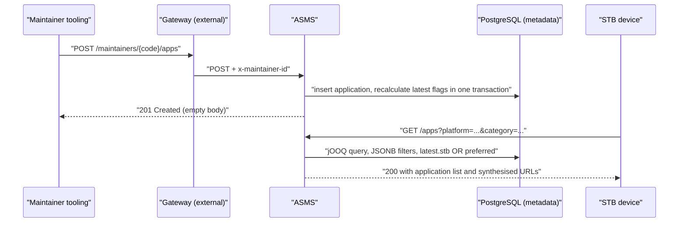
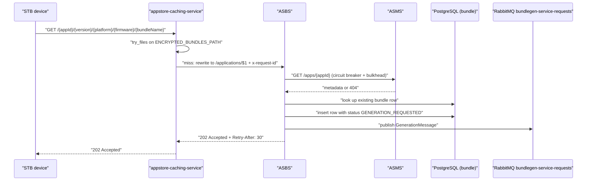
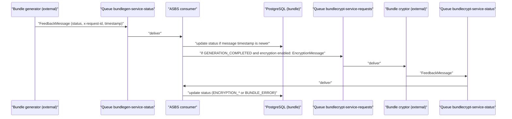

# 01 — High-Level Design

Dossier index: [README.md](README.md) · Siblings: [00-overview-and-scope.md](00-overview-and-scope.md) · [01-hld.md](01-hld.md) · [02-lld.md](02-lld.md) · [03-processes-L1-L4.md](03-processes-L1-L4.md) · [04-business-journeys.md](04-business-journeys.md) · [05-urs.md](05-urs.md) · [06-test-cases.md](06-test-cases.md) · [07-capability-matrix.md](07-capability-matrix.md) · [08-fit-gap.md](08-fit-gap.md) · [09-consolidation-recommendation.md](09-consolidation-recommendation.md) · [10-open-questions.md](10-open-questions.md)

Citation and labelling conventions are defined in [00-overview-and-scope.md](00-overview-and-scope.md).

## 1. Platform context

Notes on the diagram:

- **Clients.** STB devices consume the STB perspective of ASMS (`/apps`) and fetch bundles through the caching service; maintainer/AS3 tooling uses the maintainer perspective (`/maintainers/**`). [VERIFIED] `appstore-metadata-service appstore-metadata-service/src/main/java/com/lgi/appstore/metadata/api/stb/StbAppsController.java:42-96`, `appstore-metadata-service appstore-metadata-service/src/main/java/com/lgi/appstore/metadata/api/maintainer/MaintainerAppsController.java:46-150`.
- **API gateway / proxy layer.** [INFERRED] / external. No code in these repositories authenticates requests or reads `x-maintainer-id`. The in-repo evidence is (a) the OpenAPI description of the header — "Identifier of the requesting maintainer. Value should be set by intermediate proxies/api gateways", `required: false` [VERIFIED] `appstore-metadata-service appstore-metadata-service/src/main/resources/static/appstore-metadata-service.yaml:194-200`; and (b) the local docker-compose `as3proxy`, an Nginx container that hardcodes `proxy_set_header x-maintainer-id abcd1234` behind HTTP basic auth on `/as3` [VERIFIED] `appstore-metadata-service appstore-metadata-service/docker-compose/as3proxy/nginx.conf:57-64`, `appstore-metadata-service appstore-metadata-service/docker-compose/docker-compose.yml:34-46`. The docker-compose setup is a development harness, not the production gateway.
- **asbm-backend** is external with no repository in scope; see [00-overview-and-scope.md](00-overview-and-scope.md). [VERIFIED] `appstore-caching-service appstore-caching-service-nginx/default.conf.template:24-26,50-87`.
- **RabbitMQ, 4 queues, unknown workers.** Queue names come from configuration; the generator and cryptor that consume the `-requests` queues and publish to the `-status` queues are not in these repositories. [VERIFIED] `appstore-bundle-service appstore-bundle-service-application/src/main/resources/config/application.properties:29-32`, `appstore-bundle-service helm/appstore-bundle-service/values.yaml:46-49`.
- **Two databases.** ASMS and ASBS each own a PostgreSQL schema and never read each other's tables — ASBS reaches ASMS over HTTP only. ASMS: `database.schema=${JDBC_SCHEMA:appstore_metadata_service}` [VERIFIED] `appstore-metadata-service appstore-metadata-service/src/main/resources/config/application.properties:3-10`. ASBS uses separate write/read datasource hosts (`WRITE_NODE_JDBC_HOST`, `READ_NODE_JDBC_HOST`) against schema `appstore_bundle_service` [VERIFIED] `appstore-bundle-service helm/appstore-bundle-service/values.yaml:35-41`.
- **Shared bundle volume.** The caching service mounts the bundle generator's PVC read-only at `/data` and serves files from `ENCRYPTED_BUNDLES_PATH=/data/nginx`. [VERIFIED] `appstore-caching-service helm/appstore-caching-service/templates/deployment.yaml:74-102`, `appstore-caching-service helm/appstore-caching-service/values.yaml:30-34`, `appstore-caching-service helm/appstore-caching-service/templates/pvc.yaml:20-32`. That the generator/cryptor writes into the same volume is [INFERRED] — the PVC is named `bundle-generator-service-bundle-generator-service` and mounted read-only here, but the writer is out of scope.

## 2. Technology stack per service

| Aspect | appstore-metadata-service (ASMS) | appstore-bundle-service (ASBS) | appstore-caching-service |
| --- | --- | --- | --- |
| Language / level | Java, `java.version=11` [VERIFIED] `appstore-metadata-service pom.xml:23` | Java, `java.version=11` [VERIFIED] `appstore-bundle-service pom.xml:29` | Nginx configuration + Java only for tests, `maven.compiler.source=11` / `maven.compiler.target=11` [VERIFIED] `appstore-caching-service pom.xml:15-16` |
| Framework | Spring Boot 2.6.6 (`spring-boot-starter-parent`), springdoc-openapi UI [VERIFIED] `appstore-metadata-service pom.xml:11-15,25`, `appstore-metadata-service appstore-metadata-service/src/main/resources/config/application.properties:14-15` | Spring Boot 2.6.6 [VERIFIED] `appstore-bundle-service pom.xml:7-12,51` | Nginx 1.21 base image [VERIFIED] `appstore-caching-service pom.xml:17` (`nginx.version`), `appstore-caching-service appstore-caching-service-nginx/pom.xml:29-33` |
| Database / access | PostgreSQL via `spring-boot-starter-jooq`; Flyway migrations; jOOQ code generation [VERIFIED] `appstore-metadata-service appstore-metadata-service/pom.xml:97-110,325-326,353-383` | PostgreSQL 42.3.5, jOOQ 3.16.6, Flyway 8.5.10 [VERIFIED] `appstore-bundle-service pom.xml:31-33` | none (stateless; reads files from a mounted volume) [VERIFIED] `appstore-caching-service appstore-caching-service-nginx/default.conf.template:33-36` |
| Messaging | none | RabbitMQ (`external/rabbitmq-client` module, publishes to the default exchange) [VERIFIED] `appstore-bundle-service appstore-bundle-service-external/rabbitmq-client/src/main/java/com/lgi/appstorebundle/external/ManagedRabbitMQ.java` | none |
| Resilience | none in code (no circuit breaker / retry libraries) [VERIFIED — absence: no resilience4j dependency in `appstore-metadata-service pom.xml`] | Resilience4j 1.6.1 circuit breaker + bulkhead around ASMS calls, plus micrometer/prometheus binding [VERIFIED] `appstore-bundle-service pom.xml:53-57,266-276` | Nginx-level only: `proxy_intercept_errors on` with 5xx normalisation [VERIFIED] `appstore-caching-service appstore-caching-service-nginx/default.conf.template:37-38,131-134` |
| Build | Maven multi-module (`appstore-metadata-service`, `appstore-metadata-service-tests`) [VERIFIED] `appstore-metadata-service pom.xml:17-20` | Maven multi-module (api, application, storage, external, test) [VERIFIED] `appstore-bundle-service pom.xml:20-26` | Maven multi-module (`appstore-caching-service-nginx`, `appstore-caching-service-test`) [VERIFIED] `appstore-caching-service pom.xml:6-11` and the `modules` block of the same file |
| Container | jib-maven-plugin 2.2.0, base image `openjdk:13.0.2-jdk-slim` [VERIFIED] `appstore-metadata-service appstore-metadata-service/pom.xml:276-290` | docker-maven-plugin, base image `eclipse-temurin:17-jdk-jammy`, port 8080 [VERIFIED] `appstore-bundle-service appstore-bundle-service-application/pom.xml:193-196` | docker-maven-plugin 0.40.2 from `nginx:1.21`, adds `nginx-bundles` group, bakes templates and the OpenAPI file into `/etc/nginx` [VERIFIED] `appstore-caching-service appstore-caching-service-nginx/pom.xml:16-75` |
| Helm chart | `helm/appstore-metadata-service` (configMap includes `BUNDLES_STORAGE_PROTOCOL`, `BUNDLES_STORAGE_HOST`) [VERIFIED] `appstore-metadata-service helm/appstore-metadata-service/values.yaml:42-43` | `helm/appstore-bundle-service` (configMap with JDBC, ASMS URL, retry-after, queues, RabbitMQ host/port, bundle extension; sealed secrets for JDBC creds) [VERIFIED] `appstore-bundle-service helm/appstore-bundle-service/values.yaml:22-60` | `helm/appstore-caching-service` (configMap, deployment with swagger init container, read-only PVC, service 80→8080) [VERIFIED] `appstore-caching-service helm/appstore-caching-service/values.yaml:20-45` |
| CI | GitHub Actions: `build`, `test`, `release`, `set-version`, `helm-release`, `static` [VERIFIED] `appstore-metadata-service .github/workflows/` | same six workflows [VERIFIED] `appstore-bundle-service .github/workflows/` | same six workflows [VERIFIED] `appstore-caching-service .github/workflows/` |

Discrepancy worth noting: both Java services compile at **Java 11** (`java.version=11`) while their runtime images are **JDK 13** (ASMS) and **JDK 17** (ASBS). Any statement that ASMS "is Java 13" or ASBS "is Java 17" describes the base image, not the compiler target. [VERIFIED] `appstore-metadata-service pom.xml:23` + `appstore-metadata-service appstore-metadata-service/pom.xml:288-290`; `appstore-bundle-service pom.xml:29` + `appstore-bundle-service appstore-bundle-service-application/pom.xml:193`.

## 3. Cross-service data flows

### 3.1 Metadata flow (maintainer write → STB read)

1. A maintainer creates/updates/deletes an application version through `/maintainers/{maintainerCode}/apps`; the write and the recalculation of the `latest` JSONB flags happen in one transaction. [VERIFIED] `appstore-metadata-service appstore-metadata-service/src/main/java/com/lgi/appstore/metadata/api/maintainer/MaintainerAppsController.java:98-150`, `appstore-metadata-service appstore-metadata-service/src/main/java/com/lgi/appstore/metadata/api/maintainer/PersistentAppsService.java` (see [02-lld.md](02-lld.md) for the exact ranges).
2. STBs read `/apps` and `/apps/{appId}`; when no version is given the query defaults to "latest for STB **or** preferred". [VERIFIED] `appstore-metadata-service appstore-metadata-service/src/main/java/com/lgi/appstore/metadata/api/stb/PersistentAppsService.java`.
3. For native applications ASMS synthesises the download URL from `BUNDLES_STORAGE_PROTOCOL` / `BUNDLES_STORAGE_HOST`; web and Android applications return their own source URL. [VERIFIED] `appstore-metadata-service appstore-metadata-service/src/main/java/com/lgi/appstore/metadata/config/BeanConfiguration.java:36-48`, `appstore-metadata-service appstore-metadata-service/src/main/java/com/lgi/appstore/metadata/util/ApplicationUrlCreator.java`.

### 3.2 Bundle request flow (cache miss → generation)

Evidence: `try_files $uri $uri/ @backend` with `root ${ENCRYPTED_BUNDLES_PATH}` and the `@backend` rewrite/proxy [VERIFIED] `appstore-caching-service appstore-caching-service-nginx/default.conf.template:33-36,89,126-129`; the ASBS endpoint returning `202` with `Retry-After` from `http.retry.after=${HTTP_RETRY_AFTER:30s}` [VERIFIED] `appstore-bundle-service appstore-bundle-service-application/src/main/java/com/lgi/appstorebundle/resources/AppStoreBundleController.java:58-115`, `appstore-bundle-service appstore-bundle-service-application/src/main/resources/config/application.properties:22`; unknown application → 404 via the ASMS lookup [VERIFIED] `appstore-bundle-service appstore-bundle-service-application/src/main/java/com/lgi/appstorebundle/service/ApplicationMetadataService.java`.

### 3.3 Feedback flow (worker status → ASBS state, optional encryption)

Evidence: the two status-queue consumers and their validation (messages without `x-request-id` or without a timestamp are dropped) [VERIFIED] `appstore-bundle-service appstore-bundle-service-application/src/main/java/com/lgi/appstorebundle/configuration/RabbitMQConsumersConfiguration.java:68-122`, `appstore-bundle-service appstore-bundle-service-application/src/main/java/com/lgi/appstorebundle/util/ConsumerFactory.java`; the encryption decision on the feedback path re-reading the persisted `encryption` column [VERIFIED] `appstore-bundle-service appstore-bundle-service-application/src/main/java/com/lgi/appstorebundle/util/EncryptionHelper.java`. Details and the drift risk are in [02-lld.md](02-lld.md) and [08-fit-gap.md](08-fit-gap.md).

### 3.4 Delivery flow (cache hit)

Once a worker has written the (encrypted) bundle into the shared NFS volume, the caching service serves it directly from disk: the request path is resolved against `root ${ENCRYPTED_BUNDLES_PATH}` (`/data/nginx` in the chart) and only falls through to `@backend` when no file matches. ASBS is therefore not in the hot path for cache hits. [VERIFIED] `appstore-caching-service appstore-caching-service-nginx/default.conf.template:33-36`, `appstore-caching-service helm/appstore-caching-service/values.yaml:30-34`, `appstore-caching-service helm/appstore-caching-service/templates/deployment.yaml:74-102`.

The client-visible path served by the cache (`/{appId}/{appVersion}/{platformName}/{firmwareVersion}/{appBundleName}`) matches the ASMS-synthesised native application URL shape and, after the `@backend` rewrite, the ASBS endpoint path. That these three are intended to be the same URL contract is [INFERRED]; the alignment is visible across `appstore-caching-service appstore-caching-service-nginx/appstore-caching-service.yaml:26-60`, `appstore-bundle-service appstore-bundle-service-application/src/main/resources/static/appstore-bundle-service.yaml:26-60`, and `appstore-metadata-service appstore-metadata-service/src/main/java/com/lgi/appstore/metadata/util/ApplicationUrlCreator.java`, but no repository states the linkage (and ASMS's storage host is configured independently — see [10-open-questions.md](10-open-questions.md)).
