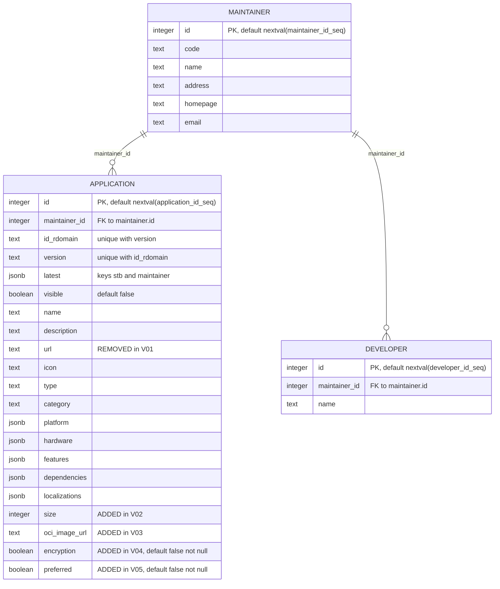
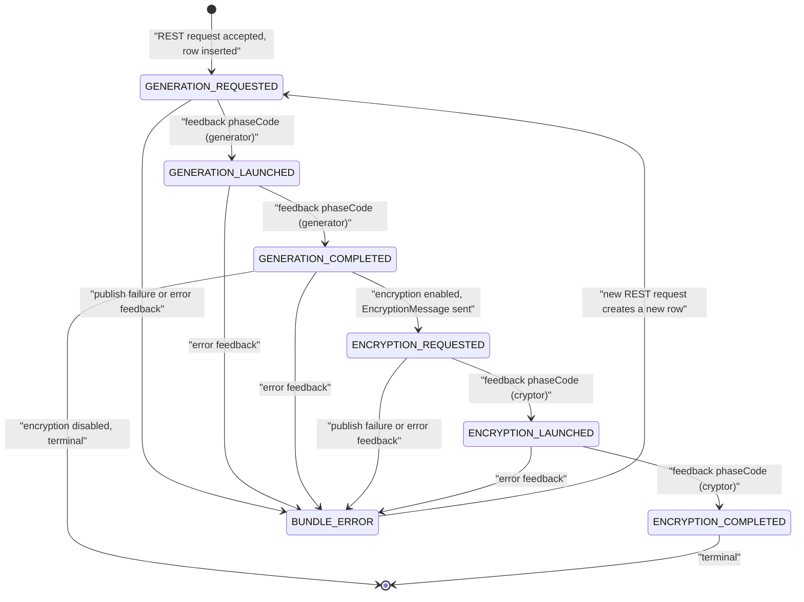
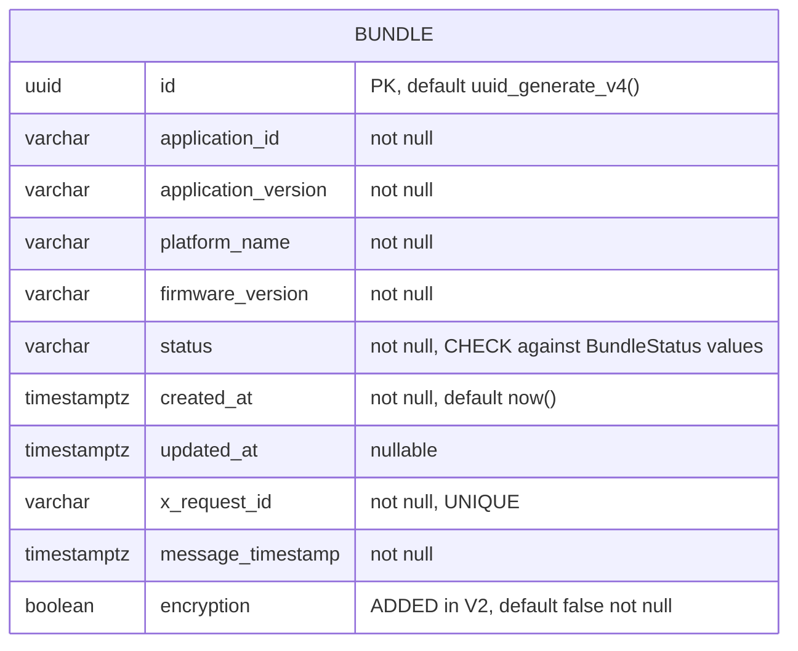

# 02 — Low-Level Design

Dossier index: [README.md](README.md) · Siblings: [00-overview-and-scope.md](00-overview-and-scope.md) · [01-hld.md](01-hld.md) · [02-lld.md](02-lld.md) · [03-processes-L1-L4.md](03-processes-L1-L4.md) · [04-business-journeys.md](04-business-journeys.md) · [05-urs.md](05-urs.md) · [06-test-cases.md](06-test-cases.md) · [07-capability-matrix.md](07-capability-matrix.md) · [08-fit-gap.md](08-fit-gap.md) · [09-consolidation-recommendation.md](09-consolidation-recommendation.md) · [10-open-questions.md](10-open-questions.md)

Citation and labelling conventions are defined in [00-overview-and-scope.md](00-overview-and-scope.md).

---

# A. appstore-metadata-service (ASMS)

## A.1 REST surface as implemented by the controllers

All findings in this section are [VERIFIED] against the controller sources.

### `StbAppsController` — `@RequestMapping("/apps")`
`appstore-metadata-service appstore-metadata-service/src/main/java/com/lgi/appstore/metadata/api/stb/StbAppsController.java:43-101`

| Method / path | Parameters | Statuses | Notes |
| --- | --- | --- | --- |
| `GET /apps` | query: `name`, `description`, `version`, `type`, `platform` (`Platform`), `category` (`Category`), `maintainerName`, `offset`, `limit` — all `required = false` | `200` | Always returns `200` with a (possibly empty) list. `StbAppsController.java:78-96` |
| `GET /apps/{appId:.+}` | bound via `StbAppsListParams` (setter-injected `appId`, `platformName`, `firmwareVer`) | `200`, `404`; `400` from the validator; `500` via the advice | `appId` may carry a version suffix (`appId:version`); `.+` in the mapping allows dots in the reverse-domain id. `StbAppsController.java:53-76`, `appstore-metadata-service appstore-metadata-service/src/main/java/com/lgi/appstore/metadata/api/stb/input/StbAppsListParams.java:23-58` |

`GET /apps/{appId}` resolves the application type first, then runs `PlatformAndVersionOptionalForWebValidator`: unsupported type → `UnsupportedApplicationTypeException`; native type with blank `platformName` or `firmwareVer` → `MandatoryFieldForNativeAppNotFound`; web/Android type → platform and firmware are *ignored* (set to `null` before the lookup). `appstore-metadata-service appstore-metadata-service/src/main/java/com/lgi/appstore/metadata/api/stb/input/validator/PlatformAndVersionOptionalForWebValidator.java:43-62`, `StbAppsController.java:61-67`.

### `MaintainerAppsController` — `@RequestMapping("/maintainers/{maintainerCode}")`
`appstore-metadata-service appstore-metadata-service/src/main/java/com/lgi/appstore/metadata/api/maintainer/MaintainerAppsController.java:47-147`

| Method / path | Parameters | Statuses |
| --- | --- | --- |
| `GET /maintainers/{maintainerCode}/apps/{appId:.+}` | path `maintainerCode`, `appId`; query `platformName`, `firmwareVer` — both **mandatory** (`@RequestParam` without `required = false`) | `200`, `404`, `400` when a required query param is missing |
| `GET /maintainers/{maintainerCode}/apps` | query `name`, `description`, `version`, `type`, `platform`, `category`, `offset`, `limit` (all optional) | `200` |
| `POST /maintainers/{maintainerCode}/apps` | `@Valid @RequestBody Application` | `201`, `400` on bean-validation failure, `409` on `ApplicationAlreadyExistsException` |
| `PUT /maintainers/{maintainerCode}/apps/{appId:.+}` | `@Valid @RequestBody ApplicationForUpdate`; `appId` may be `id`, `id:version` or `id:latest` | `204` when updated, `404` when not found |
| `DELETE /maintainers/{maintainerCode}/apps/{appId:.+}` | `appId` may be `id:all`, `id:latest` or `id:version` | `204` when deleted, `404` when nothing matched |

`DELETE` dispatches on the parsed id: `isAll()` → delete all versions, `isLatest()` → delete the maintainer-latest row, otherwise delete the exact version. `MaintainerAppsController.java:129-147`.

Note: the class is package-private (`class MaintainerAppsController`), unlike the other two controllers. `MaintainerAppsController.java:48`.

### `MaintainersController` — `@RequestMapping("/maintainers")`
`appstore-metadata-service appstore-metadata-service/src/main/java/com/lgi/appstore/metadata/api/maintainer/MaintainersController.java:43-107`

| Method / path | Parameters | Statuses |
| --- | --- | --- |
| `GET /maintainers` | query `name`, `limit`, `offset` (optional) | `200` |
| `GET /maintainers/{maintainerCode}` | path `maintainerCode` | `200`; `404` via `MaintainerNotFoundException` → advice |
| `POST /maintainers` | `@Valid @RequestBody Maintainer` | `201`, `409` on `MaintainerAlreadyExistsException` |
| `PUT /maintainers/{maintainerCode}` | `@Valid @RequestBody MaintainerForUpdate` | `204`, `404` |
| `DELETE /maintainers/{maintainerCode}` | path `maintainerCode` | `204`, `404` |

### Headers

No controller declares `@RequestHeader`, and no filter/interceptor in the codebase reads `x-maintainer-id`; the header is a documentation-and-gateway concern only. [VERIFIED — absence] no `x-maintainer-id` occurrence under `appstore-metadata-service appstore-metadata-service/src/main/java/`, header documented at `appstore-metadata-service appstore-metadata-service/src/main/resources/static/appstore-metadata-service.yaml:194-200`.

## A.2 Complete OpenAPI path list and controller/spec mismatches

Spec: `appstore-metadata-service appstore-metadata-service/src/main/resources/static/appstore-metadata-service.yaml`, `paths:` at line 30, `components:` at line 635. Complete list of paths and operations [VERIFIED]:

| OpenAPI path | Operations (`operationId`) | Spec lines |
| --- | --- | --- |
| `/apps` | `get` → `listApplications` | 31-114 |
| `/apps/{applicationId}` | `get` → `getApplicationDetails` | 115-165 |
| `/maintainers` | `get` → `getMaintainers`; `post` → `createMaintainer` | 166-250 |
| `/maintainers/{maintainerCode}` | `get` → `getMaintainer`; `put` → `replaceMaintainer`; `delete` → `deleteMaintainer` | 251-362 |
| `/maintainers/{maintainerCode}/apps` | `get` → `listMaintainerApplications`; `post` → `createMaintainerApplication` | 363-490 |
| `/maintainers/{maintainerCode}/apps/{applicationId}` | `put` → `replaceMaintainerApplication`; `get` → `getMaintainerApplication`; `delete` → `deleteMaintainerApplication` | 491-634 |

That is six paths and twelve operations, matching the twelve controller handler methods one-for-one in method+path terms.

Observed mismatches / divergences:

1. **Path variable name.** Spec uses `{applicationId}`, controllers use `{appId:.+}`. Functionally equivalent for routing but the names differ, so generated clients and the hand-written controllers do not share nomenclature. [VERIFIED] spec lines 115, 491 vs `StbAppsController.java:53`, `MaintainerAppsController.java:55`.
2. **`x-maintainer-id` is documented but never read.** Present on maintainer-perspective operations (spec lines 194, 224, 258, 297, 333, 377, 466, 512, 555, 613), `required: false`. No code reads it. [VERIFIED] as in A.1.
3. **STB detail endpoint marks `platformName`/`firmwareVer` as `required: true`,** but the controller binds them through `StbAppsListParams` with no `required` enforcement, and the validator deliberately *ignores* them for web/Android applications. A web-application request without them succeeds in code while violating the spec. [VERIFIED] spec lines 129-140 vs `StbAppsController.java:53-76` and `PlatformAndVersionOptionalForWebValidator.java:52-62`.
4. **The spec's `403 Access denied` responses are unreachable in this service** — nothing performs authorization. [VERIFIED — absence] e.g. spec lines 154-155, 581-582.
5. **Documented `400` error codes are prose only** (`platformName is mandatory for native apps (100217)`, `firmwareVer ... (100231)`, `unsupported application type (100237)`); the `ErrorResponse` produced by the advice contains only a `message`, no numeric code. [VERIFIED] spec lines 148-153 vs `appstore-metadata-service appstore-metadata-service/src/main/java/com/lgi/appstore/metadata/api/error/GlobalExceptionHandler.java:148-152`.
6. **`GET /maintainers/{maintainerCode}` returns `200` unconditionally in the controller**; the `404` case arrives only if the service layer throws `MaintainerNotFoundException`. [VERIFIED] `MaintainersController.java:51-61`, `GlobalExceptionHandler.java:55-58`.
7. **The `error` endpoint (`CustomErrorController`, `@RequestMapping("error")`) is not in the spec.** [VERIFIED] `appstore-metadata-service appstore-metadata-service/src/main/java/com/lgi/appstore/metadata/api/error/CustomErrorController.java:47-53`.

## A.3 Data model and column evolution (Flyway V00–V05)



Migration-by-migration [VERIFIED]:

| Migration | Change |
| --- | --- |
| `V00__Initial_schema.sql:20-62` | Creates sequences and the `maintainer` (lines 22-29), `developer` (33-37) and `application` (41-60) tables plus unique index `application_id_rdomain_version_idx` (line 62). `application` carries the `latest` JSONB and the JSONB attribute columns. |
| `V01__Remove_application_url.sql:20` | `alter table application drop column url;` |
| `V02__Add_size_column_to_application_table.sql:20` | `alter table application add column size INTEGER;` |
| `V03__Add_OCI_image_url_column.sql:20` | `alter table application add column oci_image_url text;` |
| `V04__Add_encryption_column.sql:20` | `alter table application add column encryption boolean default false not null;` |
| `V05__Add_preferred_column.sql:20` | `alter table application add column preferred boolean default false not null;` |

All under `appstore-metadata-service appstore-metadata-service/src/main/resources/db/migration/`.

Notes:
- `latest` is a JSONB document with two boolean-ish keys, `stb` and `maintainer`, written as literals such as `{"stb": true, "maintainer": false}`. [VERIFIED] `appstore-metadata-service appstore-metadata-service/src/main/java/com/lgi/appstore/metadata/api/maintainer/PersistentAppsService.java:568-590`.
- The `developer` table exists in the schema but is not used by any endpoint documented here. [INFERRED] — no controller or service in the sources read for this dossier references it.
- After V01 the application "url" is not stored: it is computed at read time (see A.5), while `oci_image_url` (V03) holds the source/image reference used for web/Android apps and for bundle generation.

## A.4 Business rules in the two `PersistentAppsService` classes

STB variant: `appstore-metadata-service appstore-metadata-service/src/main/java/com/lgi/appstore/metadata/api/stb/PersistentAppsService.java` (411 lines).
Maintainer variant: `appstore-metadata-service appstore-metadata-service/src/main/java/com/lgi/appstore/metadata/api/maintainer/PersistentAppsService.java` (640 lines).

### `latest.stb` vs `latest.maintainer`

Two different "latest" notions are maintained in one JSONB column and recalculated by `updateApplicationsLatestField` [VERIFIED] `api/maintainer/PersistentAppsService.java:538-592`:

- `latest.maintainer` → the highest version of the application for that maintainer, **regardless of visibility**: ordered by `VERSION_SORT_FIELD` (the version string split on `.` cast to `int[]`, descending) with `limit 1` (`:540-546`, sort field defined at `:74-76`).
- `latest.stb` → the highest version **restricted to `visible = true`** (`:549-553`).
- All rows of that `(maintainer, appId)` are first reset to `{"stb": false, "maintainer": false}` (`:568-572`), then: if both queries resolve to the same row, that row becomes `{"stb": true, "maintainer": true}` (`:574-579`); otherwise the maintainer-latest row becomes `{"stb": false, "maintainer": true}` and the STB-latest row `{"stb": true, "maintainer": false}` (`:581-590`).
- If no rows remain (`latestVersions.isEmpty()`), the method returns early — after a delete-all this leaves no latest flags to fix (`:564-566`).

### No-version search default: "latest OR preferred"

- STB list/detail: `latest -> 'stb' = 'true'` **OR** `preferred = true` [VERIFIED] `api/stb/PersistentAppsService.java:152-153` (list) and `:351-352` (details without explicit version).
- Maintainer list: `latest -> 'maintainer' = 'true'` OR `preferred = true` [VERIFIED] `api/maintainer/PersistentAppsService.java:131-132`; maintainer detail without version uses `latest ->> 'maintainer' = 'true'` OR `preferred = true` [VERIFIED] `:311-312`.

Note the operator difference between the two maintainer queries (`->` returning JSONB compared to the string `'true'` vs `->>` returning text). Both work for the literals written by `updateApplicationsLatestField`, but they are not the same expression. [VERIFIED] `:131` vs `:311`.

### Preferred-version selection

Because the "latest OR preferred" predicate can match two rows (the latest and a different preferred version), results are post-filtered in `ApplicationPreferredHelper` [VERIFIED] `appstore-metadata-service appstore-metadata-service/src/main/java/com/lgi/appstore/metadata/util/ApplicationPreferredHelper.java:34-78`:

- List queries (`matchByPreferredVersionForListStb`, `...ForListMaintainer`): keep a record only if no *other* record with the same `id_rdomain` has `preferred = true` — i.e. when a preferred version exists it wins and the latest row is dropped (`:39-57`).
- Detail queries (`matchByPreferredVersionForDetailsStb`, `...ForDetailsMaintainer`): if more than one row matched, return any row with `preferred = true`; otherwise return any single row (`:59-77`).

`preferred` itself is maintained on write: `updateApplicationsPreferredFieldForVersion` / `...ForLatest` first set `preferred = false` for all versions of the application, then set it on the targeted row. [VERIFIED] `api/maintainer/PersistentAppsService.java:594-620`.

### JSONB platform/category filtering

STB list filtering [VERIFIED] `api/stb/PersistentAppsService.java:142-176`:

- `name`, `description` → `containsIgnoreCase`; `version` → equality.
- Platform is decomposed into three JSONB text extractions: `platform ->> 'architecture' = ...`, `platform ->> 'variant' = ...`, `platform ->> 'os' = ...`, each added only when the corresponding field is present (`:158-168`).
- `type` → `APPLICATION.TYPE.contains(type)`, `category` → `APPLICATION.CATEGORY.contains(category)` — substring matching rather than equality (`:155-171`).
- `maintainerName` → equality on the joined `maintainer.name` (`:174-175`).

These conditions are assembled by string concatenation into `DSL.condition(...)` with the raw parameter values inlined (`:160-168`). [INFERRED] this is an injection-shaped pattern; `Platform` is a bound enum-like type, which limits exposure, so it is recorded as a risk to review rather than a confirmed vulnerability — see [08-fit-gap.md](08-fit-gap.md).

### Transactional recalculation on create/update/delete

All maintainer write paths run inside `dslContext.transaction(...)` / `transactionResult(...)` and call `updateApplicationsLatestField` before committing [VERIFIED] `api/maintainer/PersistentAppsService.java`:

| Operation | Lines | Latest/preferred recalculation |
| --- | --- | --- |
| `addApplication` | 323-385 | `updateApplicationsLatestField` at `:378` |
| `updateLatestApplication` | 387-428 | latest at `:420`, then `updateApplicationsPreferredFieldForLatest` when the payload marks the version preferred (`:421-423`) |
| `updateApplication` | 430-471 | latest at `:463`, then `updateApplicationsPreferredFieldForVersion` (`:464-466`) |
| `deleteApplication` | 473-498 | latest at `:493` |
| `deleteLatestApplication` | 500-524 | deletes the row matching `latest -> 'maintainer' = 'true'` (`:516`), then latest at `:519` |
| `deleteAllApplicationVersions` | 526-536 | deletes every version; no recalculation needed (nothing remains) |

The STB service is read-only: it exposes only `getApplicationType`, `listApplications` and the two `getApplicationDetails` overloads. [VERIFIED] `api/stb/PersistentAppsService.java:82-310`.

## A.5 Error handling

`GlobalExceptionHandler` (`@RestControllerAdvice extends ResponseEntityExceptionHandler`) [VERIFIED] `appstore-metadata-service appstore-metadata-service/src/main/java/com/lgi/appstore/metadata/api/error/GlobalExceptionHandler.java:43-153`:

| Exception | Status | Lines |
| --- | --- | --- |
| `Exception` (catch-all) | `500` | 50-52 |
| `MaintainerNotFoundException` | `404` | 55-58 |
| `ApplicationAlreadyExistsException`, `MaintainerAlreadyExistsException` | `409` | 60-63 |
| `MandatoryFieldForNativeAppNotFound`, `UnsupportedApplicationTypeException` | `400` | 65-68 |
| `MethodArgumentTypeMismatchException` | `400`, message `"<name> should be of type <type>"` or `"<name> has invalid type"` | 70-81 |
| `JsonException` | `500`, logs the offending JSON string | 83-91 |
| `MissingPathVariableException` | `400` | 93-96 |
| `MissingServletRequestParameterException` | `400`, message `"<param> parameter is missing"` | 98-104 |
| `MissingServletRequestPartException` | `400` | 106-110 |
| `MethodArgumentNotValidException` | `400`, message is the list of `field: message` and `object: message` strings | 112-128 |

Every branch funnels into `handleGenericResponse` → `handleExceptionInternal` with an `ErrorResponse` whose `message` is the exception message or the constant `"Details not available"` (`:130-152`). Note that overridden Spring handlers replace the framework's status with `400` unconditionally (`:93-96`, `:106-110`).

`CustomErrorController` implements `ErrorController` and maps `error`, returning an `ErrorResponse` built from the `message` error attribute or `"No message available"`. Combined with `server.error.whitelabel.enabled=false` and `server.error.include-stacktrace=never`, container-level errors also come back as the normalised JSON shape. [VERIFIED] `appstore-metadata-service appstore-metadata-service/src/main/java/com/lgi/appstore/metadata/api/error/CustomErrorController.java:36-57`, `appstore-metadata-service appstore-metadata-service/src/main/resources/config/application.properties:12-13`.

## A.6 URL creation rules

`ApplicationUrlService.createApplicationUrlFromApplicationRecord` chooses per application type [VERIFIED] `appstore-metadata-service appstore-metadata-service/src/main/java/com/lgi/appstore/metadata/util/ApplicationUrlService.java:36-45`:

- web (type ∈ `webApplications`) **or** Android → `ApplicationUrlCreator.createApplicationUrl(WebAppParams)`, which returns the stored source URL verbatim (i.e. `oci_image_url`, passed as `imageUrl` into `ApplicationUrlParams`) [VERIFIED] `appstore-metadata-service appstore-metadata-service/src/main/java/com/lgi/appstore/metadata/util/ApplicationUrlCreator.java:44-46`, `ApplicationUrlService.java:55-62`.
- otherwise (native/DAC) → the synthesised bundle URL from the pattern

```
%s://%s/%s/%s/%s/%s/%s-%s-%s-%s.tar.gz
protocol://host/appId/version/platformName/firmwareVer/appId-version-platformName-firmwareVer.tar.gz
```

[VERIFIED] `ApplicationUrlCreator.java:25-27,48-60`. `protocol` and `host` come from `BUNDLES_STORAGE_PROTOCOL` / `BUNDLES_STORAGE_HOST` injected in `BeanConfiguration` (`appstore-metadata-service appstore-metadata-service/src/main/java/com/lgi/appstore/metadata/config/BeanConfiguration.java:36-48`); the `.tar.gz` suffix is **hardcoded** in the pattern, unlike ASBS where the extension is configurable (`bundle.extension`) — a consolidation-relevant asymmetry. [VERIFIED] `ApplicationUrlCreator.java:27` vs `appstore-bundle-service appstore-bundle-service-application/src/main/resources/config/application.properties:4`.

The set of "web" types is configuration-driven: `webApplications.list=HTML5,LIGHTNING`. [VERIFIED] `appstore-metadata-service appstore-metadata-service/src/main/resources/config/application.properties:25`. The same property name and value also exists in ASBS's properties file (`appstore-bundle-service ...application.properties:77`), duplicating the classification across services.

---

# B. appstore-bundle-service (ASBS)

## B.1 `AppStoreBundleController`

`appstore-bundle-service appstore-bundle-service-application/src/main/java/com/lgi/appstorebundle/resources/AppStoreBundleController.java:58-124` [VERIFIED].

- Class mapping `@RequestMapping("/applications")` (`:59-60`); single handler `@GetMapping("/{appId}/{appVersion}/{platformName}/{firmwareVersion}/{appBundleName}")`, `produces = application/json` (`:84`).
- Path variables: `appId`, `appVersion`, `platformName`, `firmwareVersion`, `appBundleName` (all `@Valid @PathVariable`); header `x-request-id` is a **required** `@RequestHeader(CORRELATION_ID)` (`:85-90`), with `CORRELATION_ID = "x-request-id"` (`appstore-bundle-service appstore-bundle-service-external/client-common/src/main/java/com/lgi/appstorebundle/common/Headers.java:21-26`).
- Flow (`:91-109`): resolve metadata via `ApplicationMetadataService.getApplicationMetadata` → `orElseThrow(ApplicationNotFoundException)`; take `maintainer.code` from that response and fetch the maintainer-scoped metadata (again `orElseThrow`); look up the "latest" bundle row; if there is no row, or the row is `BUNDLE_ERROR` (predicate `IS_NOT_BUNDLE_ERROR`, `:71`), compute encryption, build a `BundleContext` with a fresh `UUID` and `GENERATION_REQUESTED`, and call `bundleService.triggerBundleGeneration`.
- Response is **always** `202 ACCEPTED` with `Retry-After` (seconds, from `http.retry.after`) and the `x-request-id` echoed back (`:111-115`). There is no `200`/`303` path: even when a generation is already in flight the client is told to retry.
- `appBundleName` is accepted, carried into `ApplicationParams`, and used for the ASMS lookup's fully-qualified name, but the generation message is built from the individual coordinates, not from this name (`:91`, `appstore-bundle-service .../RabbitMQService.java:39-52`).
- Error mapping (`appstore-bundle-service appstore-bundle-service-application/src/main/java/com/lgi/appstorebundle/error/handler/GlobalExceptionHandler.java:38-93`): `ApplicationNotFoundException` → `404` with message `"Application not found!"`; `RabbitMQException` → `500`; any other `Exception` → `500`. The body is `ErrorResponse.error{ httpStatusCode, message, details, correlationId }`, with `correlationId` read from the `x-request-id` request header.

Spec cross-check: `appstore-bundle-service appstore-bundle-service-application/src/main/resources/static/appstore-bundle-service.yaml:26-77` documents exactly this path with `x-request-id` `required: true` and responses `202`, `404`, `400`, `default`. The `500` produced by the handler is only covered by `default`. [VERIFIED]

## B.2 `BundleStatus` state machine

Enum values `GENERATION_REQUESTED`, `GENERATION_LAUNCHED`, `GENERATION_COMPLETED`, `ENCRYPTION_REQUESTED`, `ENCRYPTION_LAUNCHED`, `ENCRYPTION_COMPLETED`, `BUNDLE_ERROR`, plus `of(String)` returning `Optional.empty()` for unknown values. [VERIFIED] `appstore-bundle-service appstore-bundle-service-api/src/main/java/com/lgi/appstorebundle/api/model/BundleStatus.java:23-39`.



Transition evidence: initial `GENERATION_REQUESTED` (`AppStoreBundleController.java:117-122`); `ENCRYPTION_REQUESTED` set by `BundleService.triggerBundleEncryption` (`appstore-bundle-service appstore-bundle-service-application/src/main/java/com/lgi/appstorebundle/service/BundleService.java:95-107`); `BUNDLE_ERROR` on publish failure (`BundleService.java:78-86,99-105`); every `*_LAUNCHED` / `*_COMPLETED` transition is driven purely by the `phaseCode` in feedback messages, so the intermediate ordering above is [INFERRED] from the enum names — ASBS itself accepts **any** valid enum value from either status queue as long as the message timestamp is newer (`appstore-bundle-service appstore-bundle-service-application/src/main/java/com/lgi/appstorebundle/configuration/RabbitMQConsumersConfiguration.java:99-122`). The `BUNDLE_ERROR → GENERATION_REQUESTED` edge is a *new row*, not an in-place transition (`AppStoreBundleController.java:101-109`).

## B.3 Database schema

`appstore-bundle-service appstore-bundle-service-storage/storage-persistent/src/main/resources/migration/V1__Add_schema.sql:20-33` [VERIFIED]:

```sql
CREATE EXTENSION IF NOT EXISTS "uuid-ossp";

CREATE TABLE bundle (
    id UUID NOT NULL DEFAULT uuid_generate_v4() PRIMARY KEY,
    application_id VARCHAR(255) NOT NULL,
    application_version VARCHAR(255) NOT NULL,
    platform_name VARCHAR(255) NOT NULL,
    firmware_version VARCHAR(255) NOT NULL,
    status VARCHAR(255) NOT NULL CHECK (status IN ('GENERATION_REQUESTED', 'GENERATION_LAUNCHED', 'GENERATION_COMPLETED', 'ENCRYPTION_REQUESTED', 'ENCRYPTION_LAUNCHED', 'ENCRYPTION_COMPLETED', 'BUNDLE_ERROR')),
    created_at TIMESTAMPTZ NOT NULL DEFAULT NOW(),
    updated_at TIMESTAMPTZ,
    x_request_id VARCHAR(255) NOT NULL UNIQUE,
    message_timestamp TIMESTAMPTZ NOT NULL
);
```

`V2__Add_encryption_column.sql:20`: `alter table bundle add column encryption boolean default false not null;` [VERIFIED]



Observations:
- The `status` CHECK constraint duplicates the `BundleStatus` enum; adding a status requires a migration as well as a code change. [VERIFIED] `V1__Add_schema.sql:28` vs `BundleStatus.java:25-31`.
- `x_request_id UNIQUE` means two different clients cannot legitimately reuse a correlation id, and a retry with the same `x-request-id` for a *new* bundle row would violate the constraint. [VERIFIED] `V1__Add_schema.sql:31`; the insert path does not catch that case (`appstore-bundle-service appstore-bundle-service-storage/storage-persistent/src/main/java/com/lgi/appstorebundle/storage/persistent/JooqBundleDao.java:72-99`).
- There is no index on `(application_id, application_version, platform_name, firmware_version)`, the exact predicate of `getLatestBundle`. [VERIFIED — absence] `V1__Add_schema.sql`, `V2__Add_encryption_column.sql`.

## B.4 `BundleService` orchestration — and the `getLatestBundle` ordering quirk

`appstore-bundle-service appstore-bundle-service-application/src/main/java/com/lgi/appstorebundle/service/BundleService.java:58-115` [VERIFIED]:

- `getLatestBundle(...)` delegates straight to the DAO (`:74-76`).
- `triggerBundleGeneration(bundleContext)`: `bundleDao.saveBundleWithStatus(bundle)` then `rabbitMqService.sendGenerationMessage(...)`; if publishing returns an exception, the row is set to `BUNDLE_ERROR` and the exception is rethrown (`:78-86`). Note the row is inserted *before* the publish, so a broker outage always leaves a `BUNDLE_ERROR` row behind.
- `updateBundleStatusIfNewer(id, status, ts)` delegates to the DAO's conditional update and logs whether a row changed (`:88-93`).
- `triggerBundleEncryption(id, xRequestId)`: re-reads the bundle; sets `ENCRYPTION_REQUESTED`; publishes `encryptionMessageFactory.fromBundle(bundle)`; on publish failure sets `BUNDLE_ERROR`. If the bundle id is unknown it only logs a warning (`:95-107`).
- `isEncryptionEnabled(id)` reads the persisted `encryption` column, defaulting to `false` (with a warning) when the row is missing (`:109-114`).

**Ordering quirk — `getLatestBundle` returns the OLDEST row.** [VERIFIED] `appstore-bundle-service appstore-bundle-service-storage/storage-persistent/src/main/java/com/lgi/appstorebundle/storage/persistent/JooqBundleDao.java:53-63`:

```java
.orderBy(coalesce(BUNDLE.UPDATED_AT, BUNDLE.CREATED_AT))
.limit(1)
```

jOOQ/SQL default sort direction is ascending and no `.desc()` is applied, so for a given `(application_id, application_version, platform_name, firmware_version)` the row with the *smallest* `coalesce(updated_at, created_at)` is returned — the oldest, not the latest. Consequences:

- If the oldest row is `BUNDLE_ERROR` while a newer row is progressing normally, `IS_NOT_BUNDLE_ERROR` filters it out and the controller starts **another** generation, duplicating work and rows (`AppStoreBundleController.java:101-109`).
- Conversely, if the oldest row is a stale non-error row, a genuinely failed newer attempt is never retried.

This is a behavioural defect, not a documented design choice; nothing in the repository comments on the ordering. See [08-fit-gap.md](08-fit-gap.md).

Other DAO details [VERIFIED] `JooqBundleDao.java:65-133`: `saveBundleWithStatus` inserts `id, application_id, application_version, platform_name, firmware_version, status, x_request_id, created_at, message_timestamp, encryption` (`:72-99`); `updateStatusForBundle` updates status/`updated_at`/`message_timestamp` unconditionally (`:101-111`); `updateBundleStatusIfNewer` adds `and message_timestamp < :messageTimestamp` and reports whether a row was affected (`:113-125`) — this is the out-of-order-message guard; reads use a read-only datasource (`readDslContext`) and writes a separate write datasource (`:41-51`, configured via `spring.datasource.hikari.read.*` / `.write.*` in `appstore-bundle-service appstore-bundle-service-application/src/main/resources/config/application.properties:43-59`).

## B.5 RabbitMQ consumers and message validation

`appstore-bundle-service appstore-bundle-service-application/src/main/java/com/lgi/appstorebundle/configuration/RabbitMQConsumersConfiguration.java:44-123` [VERIFIED]:

- `@PostConstruct setUpConsumers()` registers exactly two consumers, on `getGenerationStatusQueueName()` and `getEncryptionStatusQueueName()` (`:68-79`); each gets its own `Channel` from `ManagedRabbitMQ` and is registered with `basicConsume(queue, AUTO_ACKNOWLEDGE = false, callback, cancelCallback)` (`:81-89`, constant at `:48`).
- Acknowledgement: the delivery callback is wrapped so that `channel.basicAck(deliveryTag, false)` runs *after* the handler returns (`:92-97`). Because `ConsumerFactory` swallows exceptions (see below), messages are effectively always acked; there is no requeue/DLQ path in code. [VERIFIED] `:92-97` + `appstore-bundle-service appstore-bundle-service-application/src/main/java/com/lgi/appstorebundle/util/ConsumerFactory.java:48-58`.
- Generation-status handler: update the status if newer, then if `bundleStatus == GENERATION_COMPLETED` **and** encryption is enabled for that bundle, trigger encryption (`:99-107`).
- Encryption-status handler: update the status if newer, nothing else (`:109-112`).
- Shared validation in `process(...)` (`:114-122`): the message must have a non-null `messageTimestamp`, otherwise it is logged and dropped (`"does not have a 'messageTimestamp'. Cannot be processed."`); the `phaseCode` must map to a `BundleStatus` via `BundleStatus.of`, otherwise it is logged and dropped.

`ConsumerFactory` adds the transport-level validation [VERIFIED] `ConsumerFactory.java:38-97`:

- The delivery must carry a non-empty `x-request-id` header, otherwise it is dropped with a warning (`:60-80`).
- The body must deserialise to `FeedbackMessage`, otherwise it is dropped with an error (`:82-89`).
- Any exception thrown while handling is caught and logged, and the MDC is cleared in a `finally` (`:48-58`) — so a handler failure never nacks the message.

## B.6 Message payloads

All [VERIFIED], under `appstore-bundle-service appstore-bundle-service-external/rabbitmq-client/src/main/java/com/lgi/appstorebundle/`:

| Message | Fields | Source |
| --- | --- | --- |
| `GenerationMessage` | `id` (UUID), `appId`, `appVersion`, `platformName`, `firmwareVersion`, `ociImageUrl`, `encrypt` (boolean) | `model/GenerationMessage.java:27-46` |
| `EncryptionMessage` | `id` (UUID), `appId`, `appVersion`, `platformName`, `firmwareVersion`, `ociBundleUrl`, `environment` | `model/EncryptionMessage.java:27-48` |
| `FeedbackMessage` | `id` (UUID), `phaseCode` (String), `messageTimestamp` (nullable Joda `DateTime`), `error` (nullable `ErrorMessage{code,message}`) | `model/FeedbackMessage.java:29-46`, error logged in `ConsumerFactory.java:91-96` |

`GenerationMessage` is assembled in `RabbitMQService.sendGenerationMessage` from the bundle's application context plus `ociImageUrl` and `encrypt` from the `BundleContext` [VERIFIED] `external/RabbitMQService.java:39-52`.

`EncryptionMessageFactory` builds the encryption payload [VERIFIED] `model/EncryptionMessageFactory.java:27-56`:

```
ociBundleUrl = "/{appId}/{appVersion}/{platformName}/{firmwareVersion}/{appId}-{appVersion}-{platformName}-{firmwareVersion}.{bundle.extension}"
```

(path at `:45-50`, name at `:52-56`), with `environment` from the `${environment}` property (`ENVIRONMENT`, default `DEV`) and `bundleExtension` from `${bundle.extension}` (default `tar.gz`) — both injected in `appstore-bundle-service appstore-bundle-service-application/src/main/java/com/lgi/appstorebundle/configuration/AppStoreBundleServiceConfiguration.java:73-77` and `appstore-bundle-service appstore-bundle-service-application/src/main/resources/config/application.properties:4-5`.

This path shape matches the ASMS native URL path and the caching service's served path, except that ASMS hardcodes `.tar.gz` while ASBS templates the extension (see A.6).

## B.7 `EncryptionHelper` — two-input AND rule and the feedback-path re-read

`appstore-bundle-service appstore-bundle-service-application/src/main/java/com/lgi/appstorebundle/util/EncryptionHelper.java:30-49` [VERIFIED]:

```java
public boolean isEncryptionEnabled(ApplicationMetadataForMaintainer m) {
    return encrypt && Boolean.TRUE.equals(m.getHeader().getEncryption());   // request path
}

public boolean isEncryptionEnabled(FeedbackMessage feedbackMessage) {
    return encrypt && bundleService.isEncryptionEnabled(feedbackMessage.getId());  // feedback path
}
```

- `encrypt` is the global toggle `bundle.encryption.enabled=${BUNDLE_ENCRYPTION_ENABLED:true}` (`appstore-bundle-service appstore-bundle-service-application/src/main/resources/config/application.properties:3`).
- Request path: the per-application flag comes from the ASMS maintainer-perspective response header (`encryption`, added to ASMS by migration V04). The AND result is persisted into `bundle.encryption` at insert time (`JooqBundleDao.java:85,96`).
- Feedback path: the per-application flag is **re-read from the ASBS database**, not from ASMS (`BundleService.isEncryptionEnabled` → `JooqBundleDao.isEncryptionEnabled`, `BundleService.java:109-114`, `JooqBundleDao.java:127-133`).

**Drift risks** (both follow from the two different sources):

1. Changing the ASMS per-application `encryption` flag after the row was created does not affect that in-flight bundle — the decision is frozen at request time. [VERIFIED] mechanism; whether that is desired is an open question ([10-open-questions.md](10-open-questions.md)).
2. Changing the **global** `bundle.encryption.enabled` between request and feedback *does* change the outcome, because `encrypt` is re-evaluated on the feedback path: a bundle generated with `encrypt=true` (so the generator was told `encrypt: true`) will never be sent to the cryptor if the toggle was flipped off in the meantime, and vice-versa. [VERIFIED] `EncryptionHelper.java:43-48`, `RabbitMQConsumersConfiguration.java:117-125`.
3. `RabbitMQConsumersConfiguration` also injects `@Value("${bundle.encryption.enabled}") private boolean encrypt` (`:50-51`) which is never used — dead configuration state duplicating `EncryptionHelper`'s. [VERIFIED]

## B.8 Resilience4j wrapper around the ASMS client

`AsmsClientInvoker` decorates the supplier with the circuit breaker **first**, then wraps that in the bulkhead when one is present (bulkhead outermost), for `Supplier`, `Runnable` and `CompletionStage` variants; `invoke(task, fallback)` adds `SupplierUtils.recover`. [VERIFIED] `appstore-bundle-service appstore-bundle-service-external/client-common/src/main/java/com/lgi/appstorebundle/common/r4j/AsmsClientInvoker.java:34-87` (decoration at `:67-79`).

`ClientInvokerFactory.createClientInvoker(cb, bh, clazz)` builds both, registers logging on bulkhead rejection and on every CB event, and configures the CB with `ignoreException(RecoverableException.class::isInstance)` — so `RecoverableException` neither opens nor counts against the breaker. [VERIFIED] `appstore-bundle-service appstore-bundle-service-external/client-common/src/main/java/com/lgi/appstorebundle/common/r4j/ClientInvokerFactory.java:29-64`. The bean is created in `AppStoreBundleServiceConfiguration.asmsClientInvoker()` using the ASMS CB and BH configurations (`appstore-bundle-service appstore-bundle-service-application/src/main/java/com/lgi/appstorebundle/configuration/AppStoreBundleServiceConfiguration.java:64-71`).

Actual tuning values, quoted verbatim from `appstore-bundle-service appstore-bundle-service-application/src/main/resources/config/application.properties` [VERIFIED]:

| Property (line) | Value | Bound in |
| --- | --- | --- |
| `asms.service.url` (13) | `${APPSTORE_METADATA_SERVICE_URL}` | `AsmsRestTemplateConfiguration.java:34-45` |
| `asms.r4j.cb.name` (14) | `"AppStore Metadata Service client circuit breaker"` | `AsmsCircuitBreakerConfiguration.java:31-33` |
| `asms.r4j.cb.failure_rate_threshold` (15) | `100` | `AsmsCircuitBreakerConfiguration.java:35-37` |
| `asms.r4j.cb.wait_duration_in_open_state` (16) | `5s` | `AsmsCircuitBreakerConfiguration.java:39-41` |
| `asms.r4j.cb.ring_buffer_size_in_half_open_state` (17) | `1` | `AsmsCircuitBreakerConfiguration.java:43-45` |
| `asms.r4j.cb.ring_buffer_size_in_closed_state` (18) | `5` | `AsmsCircuitBreakerConfiguration.java:47-49` |
| `asms.r4j.cb.is_automatic_transition_from_open_to_half_open_enabled` (19) | `true` | `AsmsCircuitBreakerConfiguration.java:51-53` |
| `asms.r4j.bh.name` (21) | `"AppStore Metadata Service client bulkhead"` | `AsmsBulkheadConfiguration.java:33-35` |
| `asms.r4j.bh.maxConcurrentCalls` (22) | `100` | `AsmsBulkheadConfiguration.java:37-39` |
| `asms.r4j.bh.maxWaitDuration` (23) | `500ms` | `AsmsBulkheadConfiguration.java:41-44` |
| `asms.r4j.bh.writableStackTraceEnabled` (24) | `true` | `AsmsBulkheadConfiguration.java:46-47` |
| `asms.request.timeout` (26) | `1000ms` | `AsmsRestTemplateConfiguration.java:37,43` |
| `asms.idle.timeout` (27) | `60s` | `AsmsRestTemplateConfiguration.java:38,40` |

Configuration classes are under `appstore-bundle-service appstore-bundle-service-external/appstore-metadata-service-client/src/main/java/com/lgi/appstorebundle/external/asms/configuration/`.

Two implementation notes [VERIFIED] `AsmsRestTemplateConfiguration.java:39-44`: `setReadTimeout` is called twice (with `idleTimeout` then `requestTimeout`), so the effective read timeout is `asms.request.timeout` = `1000ms` and `asms.idle.timeout` has no effect; no connect timeout is set. And `failure_rate_threshold = 100` means the breaker opens only when *every* call in the closed-state ring buffer (5 calls) fails.

ASMS client behaviour: `getApplicationByAppId` calls `apps/{applicationId}` and `getApplicationByIdAndMaintainerCode` calls `maintainers/{maintainerCode}/apps/{applicationId}`, both with `platformName` and `firmwareVer` query params and the fully-qualified `appId:version` as the path variable; a `404` maps to `Optional.empty()`, any other error status raises `AppstoreMetadataServiceClientException`. [VERIFIED] `appstore-bundle-service appstore-bundle-service-external/appstore-metadata-service-client/src/main/java/com/lgi/appstorebundle/external/asms/AppstoreMetadataServiceClient.java:52-139`.

## B.9 RabbitMQ publishing model

[VERIFIED] `appstore-bundle-service appstore-bundle-service-external/rabbitmq-client/src/main/java/com/lgi/appstorebundle/external/ManagedRabbitMQ.java:44-113`:

- One `Connection` and one `Channel` are created in `@PostConstruct start()` from `rabbitmq.url` (`amqp://${RABBITMQ_HOST}:${RABBITMQ_PORT}`), with `basicQos(PREFETCH_COUNT = 1)` (`:66-75`, `:49`); `@PreDestroy stop()` closes both (`:77-89`).
- Publishing uses the **default (nameless) exchange** with the queue name as the routing key:

```java
channel.basicPublish("", queueName, builder.build(), objectMapper.writeValueAsBytes(message));
```

  (`:103`) — i.e. direct-to-queue delivery. The only message property set is the header `x-request-id` (`:100-101`).
- **No `queueDeclare`, `exchangeDeclare` or `queueBind` anywhere in the production code** — queues must be provisioned externally (broker config or the worker services). [VERIFIED — absence] no `queueDeclare`/`exchangeDeclare` match under `appstore-bundle-service` outside tests.
- Publish failures are returned as an `OptionalException` carrying `RabbitMQException` rather than thrown (`:102-108`), which is what lets `BundleService` mark the row `BUNDLE_ERROR` before rethrowing.
- Queue names come from configuration (`appstore-bundle-service appstore-bundle-service-application/src/main/resources/config/application.properties:29-32`): `rabbitmq.generationQueueName=${GENERATION_QUEUE_NAME:bundlegen-service-requests}`, `rabbitmq.generationStatusQueueName=${GENERATION_STATUS_QUEUE_NAME:bundlegen-service-status}`, `rabbitmq.encryptionQueueName=${ENCRYPTION_QUEUE_NAME:bundlecrypt-service-requests}`, `rabbitmq.encryptionStatusQueueName=${ENCRYPTION_STATUS_QUEUE_NAME:bundlecrypt-service-status}`; the Helm chart sets the same four values (`appstore-bundle-service helm/appstore-bundle-service/values.yaml:46-49`).
- Since publishing is not confirmed (no publisher confirms/transactions) and the channel is shared, message loss on broker failure is possible without the row being marked. [INFERRED] from the absence of `confirmSelect`/`waitForConfirms` in `ManagedRabbitMQ.java`.

---

# C. appstore-caching-service

## C.1 `default.conf.template` walkthrough

File: `appstore-caching-service appstore-caching-service-nginx/default.conf.template` (151 lines). The file is baked into `/etc/nginx/templates` in the image, which is the directory the official Nginx entrypoint runs `envsubst` over at container start — that is how `${...}` placeholders are substituted. [VERIFIED] `appstore-caching-service appstore-caching-service-nginx/pom.xml:52-57`.

| Region | Behaviour |
| --- | --- |
| `:20-22` | `upstream asbs-backend { server ${ASBS_SERVICE}; }` [VERIFIED] |
| `:24-26` | `upstream asbm-backend { server ${ASBM_SERVICE}; }` — the external dependency [VERIFIED] |
| `:28-31` | `map $http_x_request_id $reqid { default $http_x_request_id; "" $request_id; }` — reuse the client's `x-request-id`, or Nginx's generated `$request_id` when absent/empty [VERIFIED] |
| `:33-39` | `server { listen 8080; root ${ENCRYPTED_BUNDLES_PATH}; try_files $uri $uri/ @backend; proxy_intercept_errors on; error_page 500 501 502 503 504 @50x; ${DNS_RESOLVER_CONFIGURATION} }` — server-level `try_files`, so *every* request first tries the filesystem [VERIFIED] |
| `:42-48` | `/swagger/` served from `/etc/nginx/`, and `/swagger/swagger.yaml` aliased to `/etc/nginx/appstore-caching-service.yaml` [VERIFIED] |
| `:50-87` | `location ~ ^/(platforms\|bundles)` → CORS blocks per method (`OPTIONS` short-circuits with `204` and `Access-Control-Max-Age 1728000`; `GET`/`POST`/`DELETE` add `Allow-Origin: *`, `Allow-Methods: GET, POST, OPTIONS, DELETE`, a fixed `Allow-Headers` list, `Expose-Headers: Content-Length,Content-Range`, `Allow-Credentials: true`), then `proxy_pass http://asbm-backend` [VERIFIED] |
| `:89-129` | `location @backend` → the same CORS blocks, then `rewrite ^\/(.+)$ /applications/$1 break;`, `proxy_pass http://asbs-backend;`, `proxy_set_header x-request-id $reqid;` [VERIFIED] |
| `:131-134` | `location @50x` → `default_type application/json; return 500 '{"error": {"httpStatusCode": 500, "message": "Internal Server Error", "details": ""}}';` [VERIFIED] |
| `:137-150` | second `server { listen 8081; }` with `location = / { deny all; }`, `/healthcheck` → `204`, `/ping` → `204` [VERIFIED] |

Env-templated variables: `ASBS_SERVICE`, `ASBM_SERVICE`, `ENCRYPTED_BUNDLES_PATH`, `DNS_RESOLVER_CONFIGURATION` (the last one injects a whole `resolver ...;` directive as a string). [VERIFIED] `:21,25,35,39` and `appstore-caching-service helm/appstore-caching-service/values.yaml:30-34`.

Behavioural notes:

- The cache is the *filesystem*, not an Nginx proxy cache: there is no `proxy_cache` anywhere in the file, so nothing the service proxies is ever cached by Nginx itself. Hits depend entirely on the generator/cryptor having written the file into the mounted volume. [VERIFIED — absence] `default.conf.template`.
- `x-request-id` is only forwarded on the `@backend` (ASBS) path; the `asbm-backend` location does **not** set it. [VERIFIED] `:86` vs `:128`.
- `proxy_intercept_errors on` combined with `error_page 500 501 502 503 504 @50x` means upstream 5xx bodies (including ASBS's structured `ErrorResponse` with its `correlationId`) are replaced by the fixed JSON above (whose body always says `httpStatusCode: 500`); the HTTP status code itself is **preserved**, not rewritten — a `503`/`504` upstream still returns `503`/`504` with the 500-shaped JSON body (confirmed at runtime against the repo-built image). [VERIFIED] `:37-38,131-134`.
- `202` from ASBS passes through unchanged (only 5xx are intercepted), which is what makes the "retry later" contract work through the cache. [VERIFIED] `:37-38`.
- The CORS blocks are duplicated verbatim between the two locations, and `add_header` inside `if` blocks is a well-known Nginx footgun (the `if` context discards inherited headers); the trailing unconditional `add_header ... always` lines at `:84-85` and `:123-124` partially compensate. [VERIFIED] the duplication; [INFERRED] the practical header-precedence consequences.

## C.2 Cross-check against the caching OpenAPI

`appstore-caching-service appstore-caching-service-nginx/appstore-caching-service.yaml:25-105` documents a single path, `GET /{appId}/{appVersion}/{platformName}/{firmwareVersion}/{appBundleName}`, with optional `x-request-id` header and responses `200` (requested file), `202`, `404`, `400`, `500` and `default`, all errors using the same `ErrorResponse` shape (`error.httpStatusCode`, `error.message`, `error.details`). [VERIFIED]

Cross-check findings:

1. The five-segment path in the spec matches what `@backend` rewrites to `/applications/$1` for ASBS. [VERIFIED] `default.conf.template:126`.
2. The spec does **not** document `/platforms`, `/bundles` (proxied to `asbm-backend`), `/swagger/`, or the port-8081 `/healthcheck` and `/ping` endpoints. [VERIFIED — absence] spec `paths:` contains one entry (lines 25-26).
3. `x-request-id` is `required: false` here (lines 56-60, `required: false` at line 58) versus `required: true` in the ASBS spec (`appstore-bundle-service appstore-bundle-service-application/src/main/resources/static/appstore-bundle-service.yaml:56-60`) — consistent with the `map` directive that generates one when absent, so the cache is what makes the ASBS requirement satisfiable. [VERIFIED]
4. The spec's `ErrorResponse` has no `correlationId` field (schema at `appstore-caching-service appstore-caching-service-nginx/appstore-caching-service.yaml:90-105`), while ASBS's does (`appstore-bundle-service appstore-bundle-service-application/src/main/resources/static/appstore-bundle-service.yaml:100`). Given the 5xx normalisation, the documented shape is what a client actually sees for server errors. [VERIFIED]
5. `400` is documented but nothing in the Nginx config produces a `400` body; it would come from ASBS and pass through. [VERIFIED] `default.conf.template:37-38`.
6. The `404` description (line 67) says "Application not found in AppStore Bundle Service" — a `404` for a missing *file* is impossible here because `try_files` always falls through to `@backend`. [VERIFIED] `:36`.

## C.3 Helm deployment details

All [VERIFIED], under `appstore-caching-service helm/appstore-caching-service/`:

- **Deployment** (`templates/deployment.yaml:28-104`): `replicas: 1`, `revisionHistoryLimit: 0`, `enableServiceLinks: false`.
  - **Swagger init container** (`:40-67`): runs `swaggerapi/swagger-ui:v3.52.1` (`values.yaml:36-38`), rewrites the petstore URL in `index.html` to `swagger.yaml` and copies the UI into `/etc/nginx/swagger`, sharing the `swagger-generator` `emptyDir` (64Mi, `:103-104`) with the main container.
  - **Main container** (`:68-97`): image `daccloud/appstore-caching-service:{{ .Chart.AppVersion }}`, `imagePullPolicy: Always`, `containerPort: 8080`, requests/limits `512Mi` memory and `100m`/`1000m` CPU, `envFrom` the chart's ConfigMap, plus `STACK_NAME`, `HOST_NAME` (field ref `metadata.name`) and `NAMESPACE`.
  - **Volumes** (`:74-78`, `:98-104`): `swagger-generator` at `/etc/nginx/swagger`, and `bundle-generator-service-data` mounted at `/data` from `persistentVolumeClaim` `{{ .Values.pvc.bundleGenerator.claimName }}` with **`readOnly: true`**. With `ENCRYPTED_BUNDLES_PATH=/data/nginx` (`values.yaml:32`) the served root is a read-only subdirectory of the generator's volume.
- **PVC** (`templates/pvc.yaml:20-32`): `accessModes: [ReadOnlyMany]`, `storage: 1Gi`, `storageClassName: nfs`, and a hardcoded `volumeName: pvc-fdff4044-ca5a-46a4-a550-c9eae21b376e` in `values.yaml:41-45` — a cluster-specific PV binding checked into the chart defaults.
- **Service** (`templates/service.yaml:28-36`): `ClusterIP`, `port: 80` → `targetPort: 8080` (`values.yaml:25-28`). Port `8081` (healthcheck/ping) is **not** exposed by the Service and the Deployment declares no `livenessProbe`/`readinessProbe` — the health endpoints exist but nothing in the chart uses them. [VERIFIED — absence] `templates/deployment.yaml`, `templates/service.yaml`.
- **ConfigMap** (`templates/configmap.yaml:20-53`) renders every key of `.Values.configMap`. The defaults define `ASBS_SERVICE`, `ENCRYPTED_BUNDLES_PATH`, `API_URL`, `DNS_RESOLVER_CONFIGURATION` (`values.yaml:30-34`).

**Missing `ASBM_SERVICE`.** The template requires `${ASBM_SERVICE}` for the `asbm-backend` upstream, but the chart's `configMap` defaults do not define it, and nothing else in the chart supplies it. Unless it is injected through overrides at deploy time, `envsubst` renders `server ;` and Nginx fails to start. [VERIFIED] `appstore-caching-service appstore-caching-service-nginx/default.conf.template:24-26` vs `appstore-caching-service helm/appstore-caching-service/values.yaml:30-34`. This is the most concrete configuration gap found in the caching service — see [08-fit-gap.md](08-fit-gap.md) and [10-open-questions.md](10-open-questions.md).

Also note `API_URL: '/etc/nginx/swagger.yaml'` in the ConfigMap (`values.yaml:33`) while the Nginx config aliases `/swagger/swagger.yaml` to `/etc/nginx/appstore-caching-service.yaml` (`default.conf.template:46-48`) — the two filenames do not match, and `API_URL` is not referenced by the template. [VERIFIED]
