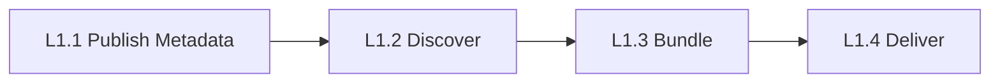
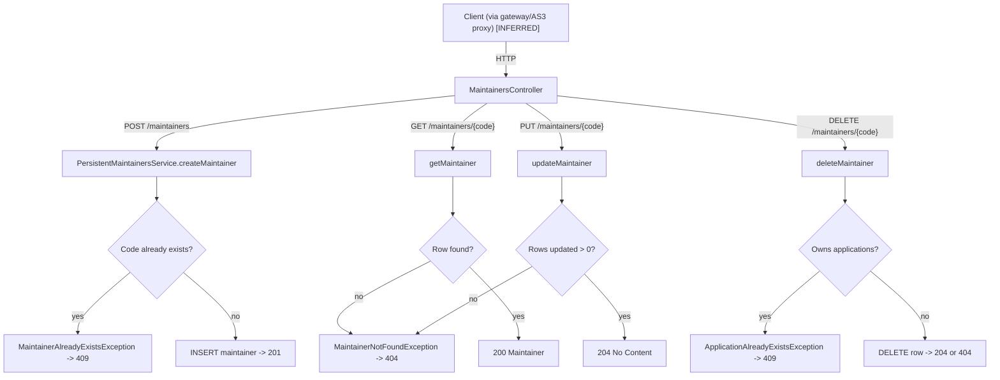
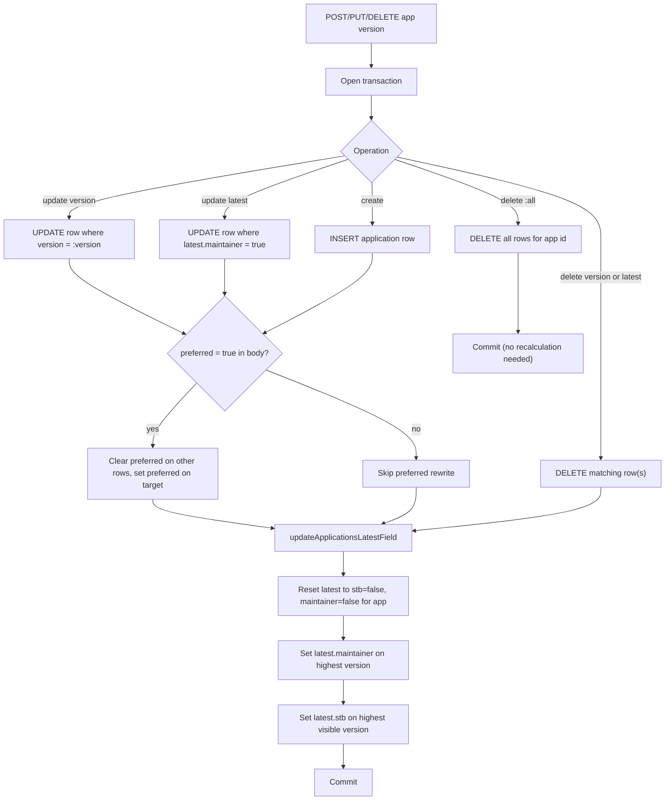
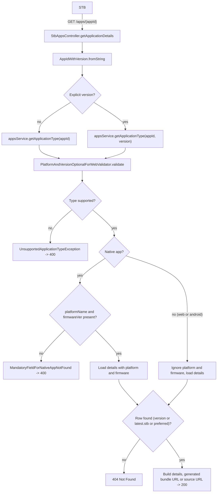
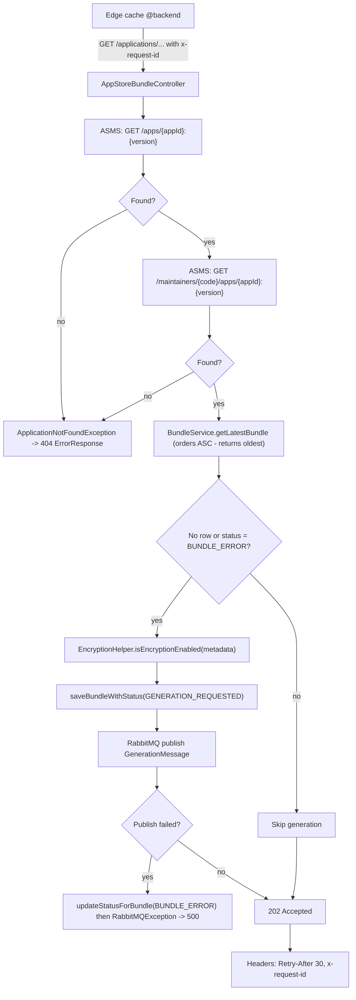
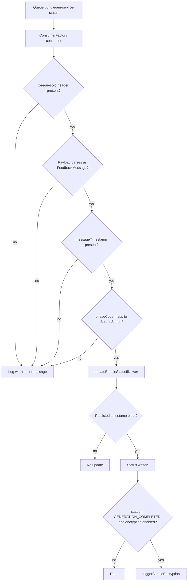
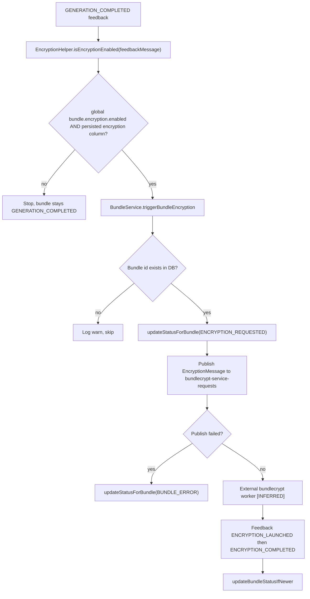
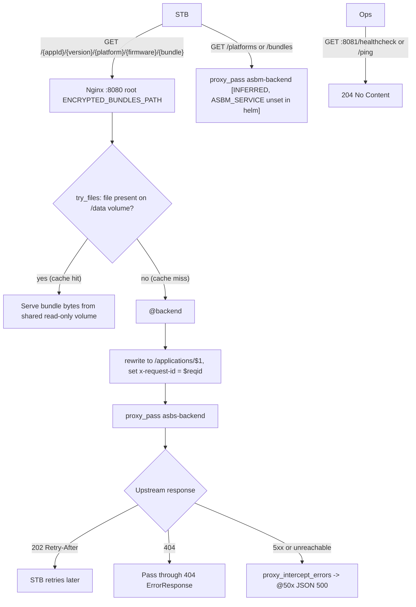

# 03 — Process decomposition (L1 → L4)

Part of the LGE AppStore reverse-engineering dossier. See [README](../README.md) and sibling docs:
[00-overview](00-overview.md) · [01-hld](01-hld.md) · [02-lld](02-lld.md) · [04-business-journeys](04-business-journeys.md) · [05-urs](05-urs.md) · [06-test-cases](06-test-cases.md)

Every non-trivial statement carries a `repo path:lines` citation and a `[VERIFIED]` / `[INFERRED]` label.
Repo short names: `appstore-metadata-service` (ASMS), `appstore-bundle-service` (ASBS), `appstore-caching-service` (cache/edge).

## L1 — Value chain

| L1 | Owner system | Entry point | Evidence |
| --- | --- | --- | --- |
| L1.1 Publish Metadata | ASMS (maintainer perspective) | `/maintainers/**` | `appstore-metadata-service appstore-metadata-service/src/main/java/com/lgi/appstore/metadata/api/maintainer/MaintainersController.java:43-107`, `.../maintainer/MaintainerAppsController.java:47-151` `[VERIFIED]` |
| L1.2 Discover | ASMS (STB perspective) | `/apps`, `/apps/{appId:.+}` | `appstore-metadata-service appstore-metadata-service/src/main/java/com/lgi/appstore/metadata/api/stb/StbAppsController.java:43-101` `[VERIFIED]` |
| L1.3 Bundle | ASBS + RabbitMQ + external workers | `/applications/{appId}/{appVersion}/{platformName}/{firmwareVersion}/{appBundleName}` | `appstore-bundle-service appstore-bundle-service-application/src/main/java/com/lgi/appstorebundle/resources/AppStoreBundleController.java:84-114` `[VERIFIED]` |
| L1.4 Deliver | Nginx caching service + shared volume | `:8080` root `try_files` / `@backend` | `appstore-caching-service appstore-caching-service-nginx/default.conf.template:33-135` `[VERIFIED]` |

## L2 map

```mermaid
flowchart TB
  P1["L1.1 Publish Metadata"] --> P11["L2.1 Manage maintainers"]
  P1 --> P12["L2.2 Manage applications"]
  P1 --> P13["L2.3 Recalculate latest / preferred"]
  P2["L1.2 Discover"] --> P21["L2.4 Search / list apps (STB)"]
  P2 --> P22["L2.5 Get app details and download URL"]
  P3["L1.3 Bundle"] --> P31["L2.6 Handle bundle request"]
  P3 --> P32["L2.7 Process generation feedback"]
  P3 --> P33["L2.8 Trigger and track encryption"]
  P4["L1.4 Deliver"] --> P41["L2.9 Serve cached bundle"]
  P4 --> P42["L2.10 Proxy on cache miss"]
  P4 --> P43["L2.11 Normalize edge errors"]
```

Boundary note: authentication/authorization is **not** implemented in any repo. The maintainer-perspective operations only accept an optional `x-maintainer-id` header described as "Value should be set by intermediate proxies/api gateways" (`appstore-metadata-service appstore-metadata-service/src/main/resources/static/appstore-metadata-service.yaml:194-200` `[VERIFIED]`), and the demo proxy hardcodes it behind basic auth (`appstore-metadata-service appstore-metadata-service/docker-compose/as3proxy/nginx.conf:56-63` `[VERIFIED]`). Any production gateway is `[INFERRED]`/unknown.

---

## L2.1 Manage maintainers (ASMS)

L3 sub-processes and L4 steps, all in `appstore-metadata-service appstore-metadata-service/src/main/java/com/lgi/appstore/metadata/api/maintainer/PersistentMaintainersService.java:61-200` `[VERIFIED]`:

- **L3.1.1 Create** — `POST /maintainers` → duplicate-code check inside a transaction, then insert; duplicate raises `MaintainerAlreadyExistsException` → HTTP 409; success is `201 Created` (`MaintainersController.java:63-70`, `PersistentMaintainersService.java:77-107`, `api/error/GlobalExceptionHandler.java:60-63`) `[VERIFIED]`.
- **L3.1.2 Read** — `GET /maintainers/{maintainerCode}` → query by code; absent code raises `MaintainerNotFoundException` → HTTP 404 (`MaintainersController.java:51-61`, `PersistentMaintainersService.java:61-75`, `GlobalExceptionHandler.java:55-58`) `[VERIFIED]`.
- **L3.1.3 List/search** — `GET /maintainers?name=&limit=&offset=` → case-insensitive prefix match on name, offset/limit applied, result metadata carries offset/limit/count/total (`MaintainersController.java:99-107`, `PersistentMaintainersService.java:160-200`) `[VERIFIED]`.
- **L3.1.4 Update** — `PUT /maintainers/{maintainerCode}` updates address, email, homepage, name transactionally; `204 No Content` on success, `404` when no row updated (`MaintainersController.java:72-85`, `PersistentMaintainersService.java:109-131`) `[VERIFIED]`.
- **L3.1.5 Delete** — `DELETE /maintainers/{maintainerCode}` refuses deletion when the maintainer still owns applications, raising `ApplicationAlreadyExistsException` → HTTP 409 (`PersistentMaintainersService.java:133-158`) `[VERIFIED]`.

---

## L2.2 Manage applications (ASMS, maintainer perspective)

Controller: `appstore-metadata-service appstore-metadata-service/src/main/java/com/lgi/appstore/metadata/api/maintainer/MaintainerAppsController.java:47-151` `[VERIFIED]`.
Service: `.../api/maintainer/PersistentAppsService.java:90-600` `[VERIFIED]`.

- **L3.2.1 Create app version** — `POST /maintainers/{code}/apps` inserts one row with every metadata attribute (reverse-domain `id_rdomain`, version, visibility, encryption, preferred, OCI image URL, name, description, icon, type, size, category and the JSONB platform/hardware/features/dependencies/localizations blocks), then recalculates latest flags in the same transaction; a duplicate key becomes `ApplicationAlreadyExistsException` → 409, and the response is `201 Created` (`PersistentAppsService.java:323-386`, `MaintainerAppsController.java:98-108`) `[VERIFIED]`.
- **L3.2.2 Read app** — `GET /maintainers/{code}/apps/{appId:.+}`; `appId` may be bare, `:latest` or `:version` per `AppIdWithVersion.fromString` (`appstore-metadata-service appstore-metadata-service/src/main/java/com/lgi/appstore/metadata/model/AppIdWithVersion.java` `[VERIFIED]`). Without an explicit version the query matches `latest -> 'maintainer' = 'true' OR preferred = true` (`PersistentAppsService.java:253-322`) `[VERIFIED]`.
- **L3.2.3 List apps** — `GET /maintainers/{code}/apps` with name/description/version/type/platform/category/offset/limit; unknown maintainer code raises `MaintainerNotFoundException` → 404; when no version filter is given the same latest-or-preferred condition applies and `ApplicationPreferredHelper.matchByPreferredVersionForListMaintainer` suppresses non-preferred duplicates (`PersistentAppsService.java:90-183`, `appstore-metadata-service appstore-metadata-service/src/main/java/com/lgi/appstore/metadata/util/ApplicationPreferredHelper.java:50-58`) `[VERIFIED]`.
- **L3.2.4 Update app** — `PUT /maintainers/{code}/apps/{appId:.+}`; bare id or `:latest` updates only the row with `latest -> 'maintainer' = 'true'`, an explicit version updates that row and may rewrite its version when the body supplies a non-blank `version`; setting `preferred = true` first clears `preferred` on all other rows of the same app; latest flags are recalculated transactionally; `204` on success, `404` when nothing matched (`PersistentAppsService.java:387-472`, `MaintainerAppsController.java:110-127`) `[VERIFIED]`.
- **L3.2.5 Delete app** — `DELETE /maintainers/{code}/apps/{appId:.+}` supports explicit version, latest (`:latest`/bare) and `:all`; explicit/latest deletes recalculate latest flags (`PersistentAppsService.java:473-537`, `MaintainerAppsController.java:129-151`) `[VERIFIED]`.

### L2.3 Recalculate latest / preferred (L4 detail)

`PersistentAppsService.updateApplicationsLatestField` resets every row of the app to `{"stb": false, "maintainer": false}`, then re-marks two rows independently: the highest version overall (`latest.maintainer`) and the highest **visible** version (`latest.stb`), ordering by the dot-separated numeric version parsed descending (`appstore-metadata-service appstore-metadata-service/src/main/java/com/lgi/appstore/metadata/api/maintainer/PersistentAppsService.java:538-600`) `[VERIFIED]`. This is why an invisible newest version is still "latest" for its maintainer but not for STBs `[VERIFIED]`.

---

## L2.4 / L2.5 Discover (ASMS, STB perspective)

- **L3.4.1 List** — `GET /apps` accepts `name`, `description`, `version`, `type`, `platform`, `category`, `maintainerName`, `offset`, `limit` (`appstore-metadata-service appstore-metadata-service/src/main/java/com/lgi/appstore/metadata/api/stb/StbAppsController.java:78-101`) `[VERIFIED]`. Only visible applications are considered; with no `version` filter the condition is `latest -> 'stb' = 'true' OR preferred = true`; name/description match case-insensitively; platform is filtered on the JSONB architecture/variant/os fields; `offset` defaults to 0 and `limit` defaults to 0 meaning "no SQL limit"; the response carries offset/limit/count/total metadata (`.../api/stb/PersistentAppsService.java:111-220`) `[VERIFIED]`.
- **L3.5.1 Details** — `GET /apps/{appId:.+}` resolves the application type first, then validates platform/firmware, then loads details for the requested or latest-or-preferred version, returning 404 when absent (`StbAppsController.java:53-76`, `.../api/stb/PersistentAppsService.java:221-396`) `[VERIFIED]`.
- **L4 validation branch** — `PlatformAndVersionOptionalForWebValidator.validate` rejects unsupported types (`UnsupportedApplicationTypeException` → 400), demands `platformName` and `firmwareVer` for native apps (`MandatoryFieldForNativeAppNotFound` → 400), and reports "ignore platform/firmware" for web and Android apps (`.../api/stb/input/validator/PlatformAndVersionOptionalForWebValidator.java:43-90`, `api/error/GlobalExceptionHandler.java:65-68`) `[VERIFIED]`. The web type list is configuration-driven: `webApplications.list=HTML5,LIGHTNING` (`appstore-metadata-service appstore-metadata-service/src/main/resources/config/application.properties:25`) `[VERIFIED]`.
- **L4 URL branch** — native apps get a synthesized URL `"%s://%s/%s/%s/%s/%s/%s-%s-%s-%s.tar.gz"` built from `BUNDLES_STORAGE_PROTOCOL`/`BUNDLES_STORAGE_HOST` plus app id, version, platform and firmware; web/Android apps return their stored source URL (`.../util/ApplicationUrlCreator.java:27-60`, `.../util/ApplicationUrlService.java`, `.../config/BeanConfiguration.java`) `[VERIFIED]`.

---

## L2.6 Handle bundle request (ASBS)

Single endpoint `GET /applications/{appId}/{appVersion}/{platformName}/{firmwareVersion}/{appBundleName}`, requiring the `x-request-id` header (`appstore-bundle-service appstore-bundle-service-application/src/main/java/com/lgi/appstorebundle/resources/AppStoreBundleController.java:84-114`) `[VERIFIED]`.

L4 steps `[VERIFIED]`:
1. Fetch STB-facing metadata from ASMS; a 404 from ASMS yields an empty optional and `ApplicationNotFoundException` → HTTP 404 (`appstore-bundle-service appstore-bundle-service-external/appstore-metadata-service-client/src/main/java/com/lgi/appstorebundle/external/asms/AppstoreMetadataServiceClient.java:68-140`, `.../error/handler/GlobalExceptionHandler.java:49-53`).
2. Fetch maintainer-facing metadata using the maintainer code from step 1 (same client, `:99-140`) — this is where the per-application `encryption` flag comes from.
3. `bundleService.getLatestBundle(appId, appVersion, platformName, firmwareVersion)` (`.../service/BundleService.java:56-58`).
4. If there is no row, or the returned row has status `BUNDLE_ERROR`, mint a new `UUID`, compute effective encryption and call `triggerBundleGeneration`; otherwise skip generation (`AppStoreBundleController.java:101-110`).
5. Always answer `202 Accepted` with `Retry-After` (from `http.retry.after`, default `30s`) and echo `x-request-id` (`AppStoreBundleController.java:111-114`, `appstore-bundle-service appstore-bundle-service-application/src/main/resources/config/application.properties:1`).

**Defect to call out `[VERIFIED]`:** `JooqBundleDao.getLatestBundle` orders by `coalesce(BUNDLE.UPDATED_AT, BUNDLE.CREATED_AT)` with no `.desc()` and `limit(1)`, so it returns the **oldest** matching row, not the latest (`appstore-bundle-service appstore-bundle-service-storage/storage-persistent/src/main/java/com/lgi/appstorebundle/storage/persistent/JooqBundleDao.java:54-64`). Consequence: once a first attempt has failed with `BUNDLE_ERROR`, every later request re-reads that oldest error row and re-triggers generation even though a healthy newer attempt may exist; conversely, a successful oldest row masks a later error `[INFERRED]`.

`BundleService.triggerBundleGeneration` saves the row with `GENERATION_REQUESTED` before publishing, and flips it to `BUNDLE_ERROR` then rethrows when the publish returns an exception (`appstore-bundle-service appstore-bundle-service-application/src/main/java/com/lgi/appstorebundle/service/BundleService.java:60-76`) `[VERIFIED]`. `ManagedRabbitMQ` publishes to the **default exchange** with the queue name as routing key and no exchange/queue declaration in code, attaching `x-request-id` as a message header (`appstore-bundle-service appstore-bundle-service-external/rabbitmq-client/src/main/java/com/lgi/appstorebundle/external/ManagedRabbitMQ.java:91-112`) `[VERIFIED]`; queues must therefore be provisioned externally `[INFERRED]`.

---

## L2.7 Process generation feedback (ASBS)

Consumers are registered on the two status queues with manual acknowledgement (`appstore-bundle-service appstore-bundle-service-application/src/main/java/com/lgi/appstorebundle/configuration/RabbitMQConsumersConfiguration.java:69-130`) `[VERIFIED]`. Queue names come from `rabbitmq.*` properties: `bundlegen-service-requests`, `bundlegen-service-status`, `bundlecrypt-service-requests`, `bundlecrypt-service-status` (`appstore-bundle-service appstore-bundle-service-application/src/main/resources/config/application.properties:29-32`) `[VERIFIED]`.

L4 branches `[VERIFIED]`:
- `ConsumerFactory.createConsumer` drops (logs and does not process) any delivery without a non-empty `x-request-id` header, and drops malformed payloads, always clearing MDC in `finally` (`.../util/ConsumerFactory.java:48-90`).
- `process` drops messages without `messageTimestamp` and messages whose `phaseCode` does not map to a `BundleStatus` (`RabbitMQConsumersConfiguration.java:114-130`, `appstore-bundle-service appstore-bundle-service-api/src/main/java/com/lgi/appstorebundle/api/model/BundleStatus.java:25-45`).
- Status is written only when the incoming timestamp is strictly newer than the persisted one — `updateBundleStatusIfNewer` requires `existing timestamp < incoming` (`.../storage/persistent/JooqBundleDao.java:114-127`).
- On `GENERATION_COMPLETED` with effective encryption enabled, encryption is triggered (`RabbitMQConsumersConfiguration.java:99-108`).

The generation and encryption **workers themselves are not in any of the three repos** — `[INFERRED]`/unknown external components.

---

## L2.8 Trigger and track encryption (ASBS)

- Effective encryption on the **request** path is the global switch AND the per-application ASMS flag: `encrypt && Boolean.TRUE.equals(metadata.getHeader().getEncryption())` (`appstore-bundle-service appstore-bundle-service-application/src/main/java/com/lgi/appstorebundle/util/EncryptionHelper.java:43-46`), with the global switch from `bundle.encryption.enabled` (default `true`) (`appstore-bundle-service appstore-bundle-service-application/src/main/resources/config/application.properties:3`) `[VERIFIED]`.
- On the **feedback** path it is the global switch AND the persisted `bundle.encryption` column: `encrypt && bundleService.isEncryptionEnabled(feedbackMessage.getId())`, defaulting to `false` when absent (`.../util/EncryptionHelper.java:47-50`, `.../service/BundleService.java:91-96`, `.../storage/persistent/JooqBundleDao.java:128-137`, column added by `appstore-bundle-service appstore-bundle-service-storage/storage-persistent/src/main/resources/migration/V2__Add_encryption_column.sql`) `[VERIFIED]`. **Drift risk:** if the maintainer flips the ASMS `encryption` flag after the request was accepted, request-time and feedback-time decisions disagree; the persisted value wins on feedback `[VERIFIED]` (impact `[INFERRED]`).
- `triggerBundleEncryption` loads the bundle by id, skips with a log line when the id is unknown, sets `ENCRYPTION_REQUESTED`, sends the `EncryptionMessage`, and sets `BUNDLE_ERROR` if the send fails (`.../service/BundleService.java:77-96`) `[VERIFIED]`.
- Encryption feedback only advances status via the same newer-timestamp rule (`RabbitMQConsumersConfiguration.java:109-130`) `[VERIFIED]`.

---

## L2.9 – L2.11 Deliver (caching service)

All from `appstore-caching-service appstore-caching-service-nginx/default.conf.template:20-151` `[VERIFIED]`:

- Upstreams `asbs-backend` (`${ASBS_SERVICE}`) and `asbm-backend` (`${ASBM_SERVICE}`) `:20-26`.
- `map $http_x_request_id $reqid` falls back to Nginx `$request_id` when the client sent none `:28-31`.
- The main server listens on 8080, roots at `${ENCRYPTED_BUNDLES_PATH}` and uses a **server-level** `try_files $uri $uri/ @backend` (not a bundle-specific `location`), with `proxy_intercept_errors on` and `error_page 500 501 502 503 504 @50x` `:33-39`.
- `@backend` adds permissive CORS headers per method, rewrites `^/(.+)$` to `/applications/$1` and proxies to `asbs-backend`, setting `x-request-id: $reqid` `:89-129`.
- `location ~ ^/(platforms|bundles)` proxies to `asbm-backend` with the same CORS block `:50-87`.
- `@50x` returns a fixed JSON body `{"error": {"httpStatusCode": 500, "message": "Internal Server Error", "details": ""}}` with `default_type application/json` `:131-134`.
- A second server on 8081 exposes `/healthcheck` and `/ping` (both `204`) and `deny all` on `/` `:137-151`.
- Swagger UI is served from `/swagger/` with the spec aliased at `/swagger/swagger.yaml` `:42-48`.

Helm supplies `ASBS_SERVICE`, `ENCRYPTED_BUNDLES_PATH=/data/nginx` and `DNS_RESOLVER_CONFIGURATION`, but **not** `ASBM_SERVICE` (`appstore-caching-service helm/appstore-caching-service/values.yaml:31-34`) `[VERIFIED]` — so the `asbm-backend` upstream template variable is unresolved in the shipped chart; whether it is injected elsewhere is an open question. `asbm-backend` itself has no repository in scope: external, out-of-scope dependency `[INFERRED]`.

---

## Cross-cutting L4 concerns

- **Correlation** — both services accept `x-request-id`, generate a UUID when it is blank, put it in MDC, echo it on the response and clear MDC in `finally` (`appstore-metadata-service appstore-metadata-service/src/main/java/com/lgi/appstore/metadata/api/filter/CorrelationIdFilter.java:34-61`, `appstore-bundle-service appstore-bundle-service-application/src/main/java/com/lgi/appstorebundle/filters/CorrelationIdFilter.java:34-70`) `[VERIFIED]`.
- **Error normalization** — ASMS maps exceptions to an `ErrorResponse` (500 generic, 404 maintainer-not-found, 409 duplicates, 400 validation/type problems) and `CustomErrorController` normalizes container-level errors; ASBS maps application-not-found to 404 and RabbitMQ/generic failures to 500 with message, details, status code and correlation id (`appstore-metadata-service appstore-metadata-service/src/main/java/com/lgi/appstore/metadata/api/error/GlobalExceptionHandler.java:44-130`, `.../api/error/CustomErrorController.java:36-70`, `appstore-bundle-service appstore-bundle-service-application/src/main/java/com/lgi/appstorebundle/error/handler/GlobalExceptionHandler.java:39-60`) `[VERIFIED]`.
- **Resilience** — every ASMS client call is decorated with a circuit breaker (and a bulkhead when configured) that ignores `RecoverableException`; thresholds are `failure_rate_threshold=100`, `wait_duration_in_open_state=5s`, closed ring buffer 5, half-open ring buffer 1, automatic open→half-open transition, bulkhead `maxConcurrentCalls=100` / `maxWaitDuration=500ms` (`appstore-bundle-service appstore-bundle-service-external/client-common/src/main/java/com/lgi/appstorebundle/common/r4j/ClientInvokerFactory.java:34-64`, `appstore-bundle-service appstore-bundle-service-application/src/main/resources/config/application.properties:14-27`) `[VERIFIED]`.
- **Observability** — ASMS disables actuator endpoints by default and exposes only `info` and `prometheus` at the root base path, with Prometheus gated by `PROMETHEUS_METRICS` (`appstore-metadata-service appstore-metadata-service/src/main/resources/config/application.properties:16-23`) `[VERIFIED]`; ASBS additionally exposes `health` (`appstore-bundle-service appstore-bundle-service-application/src/main/resources/config/application.properties:68-72`) `[VERIFIED]`.

## Open questions

1. Which component provides the production gateway that sets `x-maintainer-id`, and does it enforce that a maintainer can only touch its own namespace? Nothing in the repos enforces it `[VERIFIED]` absence.
2. What deploys `ASBM_SERVICE` for the caching chart, given `values.yaml` omits it?
3. Who declares the four RabbitMQ queues, since `ManagedRabbitMQ` never declares them?
4. Which component writes encrypted bundles onto the volume the cache mounts read-only, and under what filename convention relative to the ASMS-generated URL?
5. Is the ascending `getLatestBundle` ordering intentional (e.g. "first attempt wins") or a defect? The method name and usage suggest a defect `[INFERRED]`.
