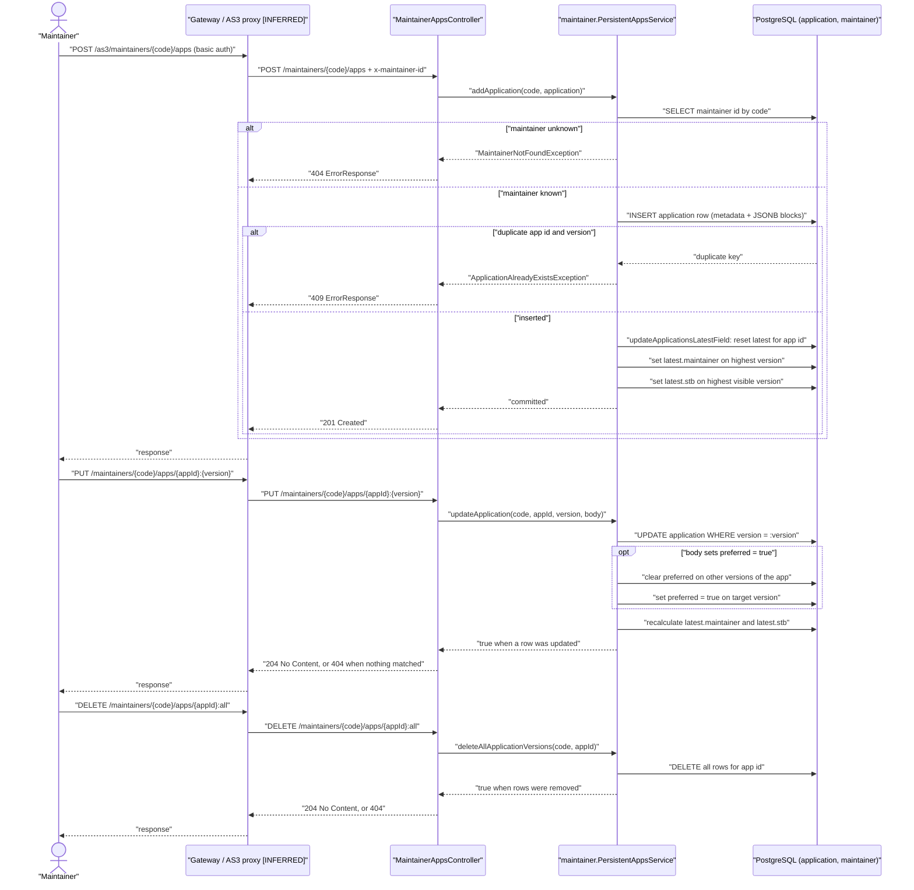
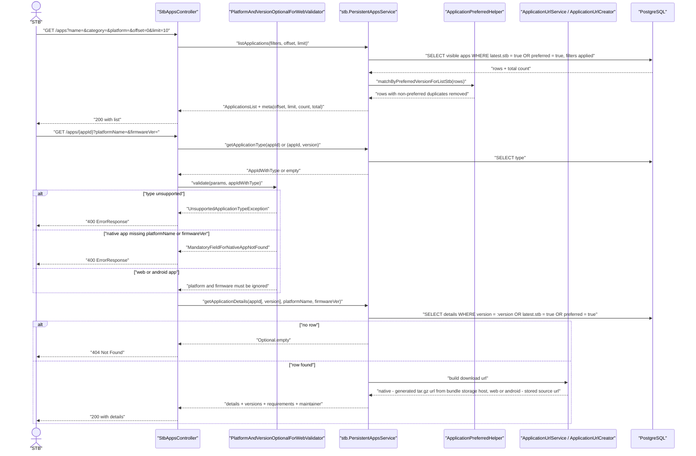
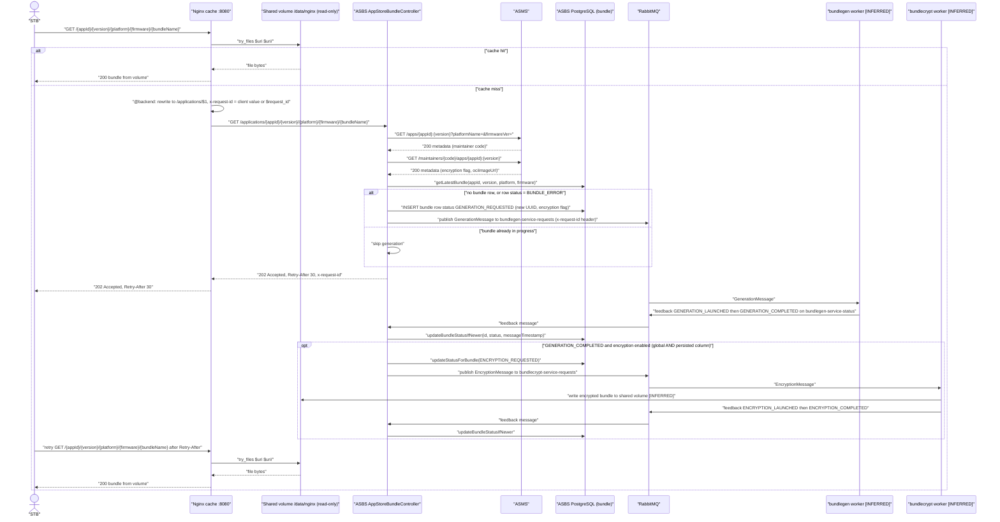
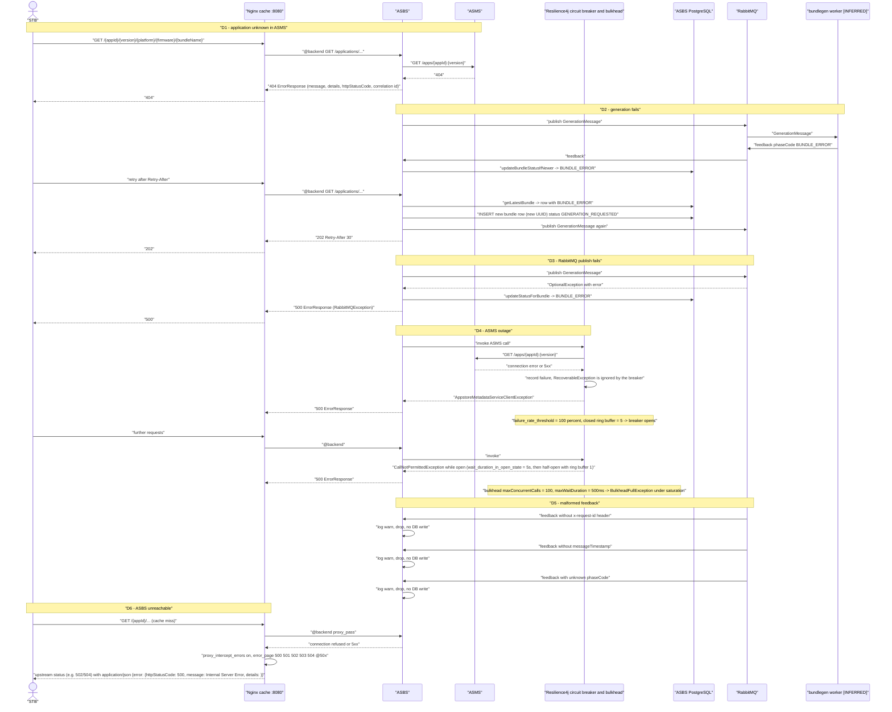

# 04 — End-to-end business journeys

Part of the LGE AppStore reverse-engineering dossier. See [README](../README.md) and sibling docs:
[00-overview](00-overview.md) · [01-hld](01-hld.md) · [02-lld](02-lld.md) · [03-processes-L1-L4](03-processes-L1-L4.md) · [05-urs](05-urs.md) · [06-test-cases](06-test-cases.md)

Every non-trivial statement carries a `repo path:lines` citation and a `[VERIFIED]` / `[INFERRED]` label.
Repo short names: `appstore-metadata-service` (ASMS), `appstore-bundle-service` (ASBS), `appstore-caching-service` (cache/edge).

## Actors and systems

| Actor / system | Role | Status |
| --- | --- | --- |
| Maintainer | Publishes and maintains application metadata | `[VERIFIED]` via maintainer endpoints (`appstore-metadata-service appstore-metadata-service/src/main/java/com/lgi/appstore/metadata/api/maintainer/MaintainerAppsController.java:47-151`) |
| Gateway / AS3 proxy | Terminates auth and injects `x-maintainer-id` | `[INFERRED]` — only a demo Nginx proxy exists (`appstore-metadata-service appstore-metadata-service/docker-compose/as3proxy/nginx.conf:56-63`) |
| STB | Reads metadata, downloads bundles | `[VERIFIED]` (`.../api/stb/StbAppsController.java:43-101`) |
| Cache (Nginx) | Serves bundles from `/data`, proxies misses to ASBS | `[VERIFIED]` (`appstore-caching-service appstore-caching-service-nginx/default.conf.template:33-135`) |
| ASBS | Orchestrates generation and encryption | `[VERIFIED]` (`appstore-bundle-service appstore-bundle-service-application/src/main/java/com/lgi/appstorebundle/resources/AppStoreBundleController.java:84-114`) |
| bundlegen / bundlecrypt workers | Build and encrypt bundles, publish feedback | `[INFERRED]` — not present in any repo |
| `asbm-backend` | Serves `/platforms` and `/bundles` | `[INFERRED]` — referenced only by the cache config; no repo in scope |

---

## Journey A — Maintainer publishes, updates and deletes an application

Flow `[VERIFIED]` from `MaintainerAppsController.java:98-151` and `appstore-metadata-service appstore-metadata-service/src/main/java/com/lgi/appstore/metadata/api/maintainer/PersistentAppsService.java:323-600`; the gateway hop is `[INFERRED]`.

Notes:
- `PUT` with a bare id or `:latest` targets only the row flagged `latest -> 'maintainer' = 'true'`, and a non-blank `version` in the body rewrites the version of the targeted row (`PersistentAppsService.java:387-472`) `[VERIFIED]`.
- Deleting an explicit version or the latest version recalculates the latest flags; `:all` removes every row so no recalculation is needed (`PersistentAppsService.java:473-537`) `[VERIFIED]`.
- A maintainer cannot be deleted while it still owns applications (`.../api/maintainer/PersistentMaintainersService.java:133-158`) `[VERIFIED]`.
- Nothing in ASMS checks that the caller owns `{maintainerCode}`; isolation depends entirely on the gateway `[VERIFIED]` (absence of checks) / `[INFERRED]` (gateway behaviour).

---

## Journey B — STB discovers and inspects applications

Notes `[VERIFIED]`:
- Only visible applications are ever returned to STBs, and with no `version` filter the latest-or-preferred rule applies (`.../api/stb/PersistentAppsService.java:111-220`).
- `offset` defaults to 0 and `limit` defaults to 0, where 0 means "no SQL limit", i.e. return everything (`.../api/stb/PersistentAppsService.java:111-220`).
- Native URLs are assembled from `BUNDLES_STORAGE_PROTOCOL`/`BUNDLES_STORAGE_HOST` and the pattern `"%s://%s/%s/%s/%s/%s/%s-%s-%s-%s.tar.gz"` (`.../util/ApplicationUrlCreator.java:27-60`, `.../config/BeanConfiguration.java`); web types are configuration-driven (`HTML5,LIGHTNING`) and Android also returns its source URL (`.../util/ApplicationUrlService.java`, `appstore-metadata-service appstore-metadata-service/src/main/resources/config/application.properties:25`).

---

## Journey C — STB downloads a bundle (cache hit and cache miss)

Notes:
- The `202` is returned unconditionally on the miss path, whether generation was newly triggered or already in flight (`appstore-bundle-service appstore-bundle-service-application/src/main/java/com/lgi/appstorebundle/resources/AppStoreBundleController.java:101-114`) `[VERIFIED]`.
- `Retry-After` is `http.retry.after`, default `30s`, rendered in seconds (`AppStoreBundleController.java:111-113`, `appstore-bundle-service appstore-bundle-service-application/src/main/resources/config/application.properties:1`) `[VERIFIED]`.
- The volume is mounted read-only at `/data` with `ENCRYPTED_BUNDLES_PATH=/data/nginx` (`appstore-caching-service helm/appstore-caching-service/values.yaml:31-34`) `[VERIFIED]`; the cache therefore never writes bundles — the producing worker does `[INFERRED]`.
- Nothing in these repos maps a `bundle` DB row to a file path on the volume; the naming contract between the ASMS-generated URL and the worker output is an open question `[INFERRED]`.

---

## Journey D — Failure and retry journeys

Evidence for the failure paths:

| Path | Evidence | Label |
| --- | --- | --- |
| D1 404 | `appstore-bundle-service appstore-bundle-service-external/appstore-metadata-service-client/src/main/java/com/lgi/appstorebundle/external/asms/AppstoreMetadataServiceClient.java:68-140`, `.../error/handler/GlobalExceptionHandler.java:49-53` | `[VERIFIED]` |
| D2 retry creates a new row | `appstore-bundle-service appstore-bundle-service-application/src/main/java/com/lgi/appstorebundle/resources/AppStoreBundleController.java:99-110` (new `randomUUID` per trigger) | `[VERIFIED]` |
| D2 caveat | `getLatestBundle` orders `coalesce(updated_at, created_at)` ascending, so the "latest" row is actually the oldest (`appstore-bundle-service appstore-bundle-service-storage/storage-persistent/src/main/java/com/lgi/appstorebundle/storage/persistent/JooqBundleDao.java:54-64`); after one failure the error row keeps being re-selected and generation is re-triggered on every request | `[VERIFIED]` code, `[INFERRED]` impact |
| D3 | `.../service/BundleService.java:60-76`, `.../error/handler/GlobalExceptionHandler.java:54-58` | `[VERIFIED]` |
| D4 | `appstore-bundle-service appstore-bundle-service-external/client-common/src/main/java/com/lgi/appstorebundle/common/r4j/ClientInvokerFactory.java:34-64`, `appstore-bundle-service appstore-bundle-service-application/src/main/resources/config/application.properties:14-27` | `[VERIFIED]` |
| D5 | `.../util/ConsumerFactory.java:48-90`, `.../configuration/RabbitMQConsumersConfiguration.java:114-130` | `[VERIFIED]` |
| D6 | `appstore-caching-service appstore-caching-service-nginx/default.conf.template:37-38,131-134` | `[VERIFIED]` |

### Encryption drift variant of D2/D3

If a maintainer flips the ASMS `encryption` flag between the accepted request and the generation feedback, the request-time decision (ASMS flag, `EncryptionHelper.java:43-46`) and the feedback-time decision (persisted `bundle.encryption` column, `EncryptionHelper.java:47-50`) diverge and the persisted value wins, so a bundle can be delivered unencrypted (or encrypted) contrary to the current metadata `[VERIFIED]` code, `[INFERRED]` operational impact.

## Open questions

1. How does an STB learn the cache hostname? ASMS builds URLs from `BUNDLES_STORAGE_HOST`, but nothing links that value to the caching service deployment `[INFERRED]`.
2. Is there any client-side or edge-level retry budget for the `202 Retry-After` loop, or does the STB retry indefinitely?
3. Are `BUNDLE_ERROR` rows ever cleaned up, and is there an alert on repeated generation retriggering?
4. What resolves `${ASBM_SERVICE}` in production, given the caching chart does not define it (`appstore-caching-service helm/appstore-caching-service/values.yaml:31-34`) `[VERIFIED]`?
