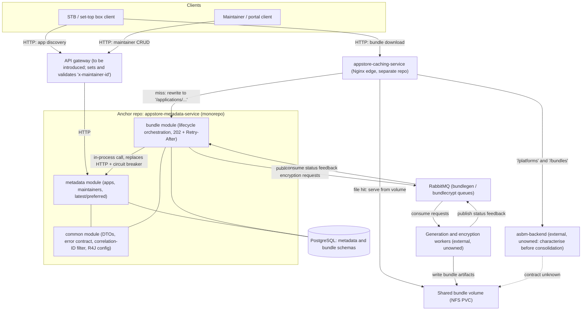

# 09 — Consolidation Recommendation

Part of the [LGE AppStore consolidation dossier](README.md). Builds directly on
[07-capability-matrix.md](07-capability-matrix.md) (what each repo does) and
[08-fit-gap.md](08-fit-gap.md) (overlaps, divergences, gaps). Everything left unresolved is listed in
[10-open-questions.md](10-open-questions.md).

Labels: **[VERIFIED]** = read in source; **[INFERRED]** = reasoned, not directly confirmed. Citations use the
form `repo path:lines`. No effort or duration estimates are given anywhere in this document.

---

## 1. Recommendation in one paragraph

Adopt **`appstore-metadata-service` (ASMS) as the anchor repository**. Fold `appstore-bundle-service` (ASBS)
into it as a second Maven module set inside one repository, sharing a new `common` domain module (models, error
contract, correlation-ID filter, resilience configuration). Keep `appstore-caching-service` as a **separate
edge component** — it is Nginx configuration, not Java, and its deployment lifecycle is legitimately different.
**Do not start the merge until `asbm-backend` is characterised and owned**: it is a live production dependency
whose only description in any in-scope repo is two Nginx routes
(`appstore-caching-service appstore-caching-service-nginx/default.conf.template:24-26,50-87`) [VERIFIED].

Whether ASMS+ASBS become one *deployable* or two deployables in one repository is a separate, later decision —
see §4 (item 9) and [10-open-questions.md](10-open-questions.md). The repository consolidation and the shared
domain module deliver most of the value and carry far less risk.

## 2. Why ASMS is the anchor

1. **It owns the domain of record.** The `maintainer` + `application` schema with JSONB `versions`, `latest`,
   `platform`/`category` filtering, plus five follow-on migrations (`size`, OCI image url, `encryption`,
   `preferred`) is the platform's only description of an application
   (`appstore-metadata-service appstore-metadata-service/src/main/resources/db/migration/V00__Initial_schema.sql:1-62`,
   `V02`–`V05`) [VERIFIED]. ASBS's schema is a single `bundle` table that carries no application attributes
   beyond the identity tuple and an `encryption` copy
   (`appstore-bundle-service appstore-bundle-service-storage/storage-persistent/src/main/resources/migration/V1__Add_schema.sql:22-33`;
   `V2__Add_encryption_column.sql:20`) [VERIFIED].
2. **Dependency direction already points at it.** ASBS calls ASMS on every request, twice
   (`appstore-bundle-service appstore-bundle-service-application/src/main/java/com/lgi/appstorebundle/resources/AppStoreBundleController.java:92-98`),
   and ships a dedicated client module with hardcoded ASMS URL templates
   (`appstore-bundle-service appstore-bundle-service-external/appstore-metadata-service-client/src/main/java/com/lgi/appstorebundle/external/asms/AppstoreMetadataServiceClient.java:56-58`).
   ASMS has no dependency on ASBS — it only *formats* a bundle URL
   (`appstore-metadata-service appstore-metadata-service/src/main/java/com/lgi/appstore/metadata/util/ApplicationUrlCreator.java:26-27,48-60`) [VERIFIED].
3. **Richest API surface, and the only complete specification.** ASMS's OpenAPI document is 1082 lines covering
   six path templates across STB and maintainer perspectives
   (`appstore-metadata-service appstore-metadata-service/src/main/resources/static/appstore-metadata-service.yaml`);
   ASBS documents a single GET
   (`appstore-bundle-service appstore-bundle-service-application/src/main/resources/static/appstore-bundle-service.yaml:26-27`),
   as does the caching service
   (`appstore-caching-service appstore-caching-service-nginx/appstore-caching-service.yaml:26-27`) [VERIFIED].
4. **Most mature test suite.** ASMS has a dedicated functional-test module of Spock specifications with
   a data/framework layer beneath it
   (`appstore-metadata-service appstore-metadata-service-tests/src/test/groovy/com/lgi/appstore/metadata/test/`),
   including sanity and smoke tiers runnable against a real environment, on top of JUnit unit tests in the
   application module (`appstore-metadata-service appstore-metadata-service/src/test/java/`). ASBS has unit
   tests plus four Testcontainers ITs
   (`appstore-bundle-service appstore-bundle-service-test/src/test/java/com/lgi/appstorebundle/test/tests/`);
   the caching service has one IT class
   (`appstore-caching-service appstore-caching-service-test/src/test/java/com/lgi/appstore/cache/test/mocked/NginxITCase.java:27-98`) [VERIFIED].
5. **Business logic density.** The non-trivial rules of the platform — dual `latest` semantics, preferred-version
   tie-breaking, native-vs-web validation — all live in ASMS
   (`appstore-metadata-service .../api/maintainer/PersistentAppsService.java:540-589`;
   `.../util/ApplicationPreferredHelper.java:34-78`;
   `.../config/BeanConfiguration.java:60-63`) [VERIFIED]. ASBS's logic is orchestration around them.

Counter-consideration: ASBS is the more modular codebase (`-api`, `-application`, `-storage`, `-external`,
`-test` modules) and its layout is the better template for the merged repository's *structure*, even though
ASMS is the better anchor for the *domain* [INFERRED]. Adopt ASBS's multi-module convention when moving ASMS in.

## 3. Target shape

Notes on the diagram:
- The `BUNDLE --> META` in-process edge is what removes ASBS's Resilience4j-wrapped HTTP hop
  (`appstore-bundle-service appstore-bundle-service-external/client-common/src/main/java/com/lgi/appstorebundle/common/r4j/AsmsClientInvoker.java:34-86`)
  — the largest single simplification available [VERIFIED that the hop exists today].
- Workers and `asbm-backend` remain outside because no in-scope repo contains them
  (`appstore-bundle-service appstore-bundle-service-application/src/main/resources/config/application.properties:29-32`;
  `appstore-caching-service appstore-caching-service-nginx/default.conf.template:24-26`) [VERIFIED].
- The gateway node is a *recommendation*, not current state: today nothing validates `x-maintainer-id`
  (see [08-fit-gap.md](08-fit-gap.md) D1) [VERIFIED].
- `asbm-backend`'s relationship to the shared volume is drawn dashed because it is unknown [INFERRED].

## 4. Migration backlog (ordered)

Each item states why it comes where it does and which code it touches. Items 1–4 are prerequisites: they are
information- and safety-gathering, and none of them move code between repositories.

1. **Characterise and assign an owner to `asbm-backend`.** Recover its API from the routes
   `location ~ ^/(platforms|bundles)` and `upstream asbm-backend`
   (`appstore-caching-service appstore-caching-service-nginx/default.conf.template:24-26,50-87`), then publish a
   spec. *Why first:* it is the only production dependency with zero documentation, and any target architecture
   that ignores it is unimplementable. It is also the one item that cannot be answered from the in-scope code at
   all. See [10-open-questions.md](10-open-questions.md) Q1.
2. **Fix `ASBM_SERVICE` in the caching chart.** Add the key to the configMap block that already carries
   `ASBS_SERVICE` (`appstore-caching-service helm/appstore-caching-service/values.yaml:30-34`, consumed via
   `envFrom` at `appstore-caching-service helm/appstore-caching-service/templates/deployment.yaml:86-88`).
   *Why here:* smallest possible change, removes a latent default-install failure, and is a prerequisite for
   trusting the chart as the description of the edge.
3. **Resolve the `getLatestBundle` ordering question and add a regression test.** The query orders ascending
   (`appstore-bundle-service appstore-bundle-service-storage/storage-persistent/src/main/java/com/lgi/appstorebundle/storage/persistent/JooqBundleDao.java:54-63`)
   and drives the regenerate-or-not decision
   (`appstore-bundle-service .../resources/AppStoreBundleController.java:99-110`). *Why before any move:*
   changing it changes observable behaviour, so it must be decided and covered while the code is still in its
   familiar shape, not attributed to the migration. See [10-open-questions.md](10-open-questions.md) Q7.
4. **Document the RabbitMQ topology and move declaration into code or infrastructure.** Publication goes to the
   default exchange with the queue name as routing key
   (`appstore-bundle-service appstore-bundle-service-external/rabbitmq-client/src/main/java/com/lgi/appstorebundle/external/ManagedRabbitMQ.java:103`),
   consumers bind by name
   (`appstore-bundle-service .../configuration/RabbitMQConsumersConfiguration.java:68-90`), and the only
   declaration anywhere is four README commands (`appstore-bundle-service README.md:16-19`). *Why here:* the
   merged deployable inherits this start-up dependency, so it must be owned before it is inherited.
5. **Introduce the shared `common` module inside ASMS.** Start with the two pieces that are provably duplicated:
   the correlation-ID filter
   (`appstore-metadata-service .../api/filter/CorrelationIdFilter.java:33-61` vs
   `appstore-bundle-service .../filters/CorrelationIdFilter.java:34-59`) and the error contract
   (`appstore-metadata-service .../api/error/GlobalExceptionHandler.java:43-153` vs
   `appstore-bundle-service .../error/handler/GlobalExceptionHandler.java:39-93`). *Why here:* it is the
   scaffolding every later item lands on, and it can be built and released while ASBS still lives elsewhere.
6. **Choose one error wire shape and version the change.** ASMS is flat `{"message"}`
   (`appstore-metadata-service appstore-metadata-service/src/main/resources/static/appstore-metadata-service.yaml:1052-1058`),
   ASBS is nested `{"error":{...}}`
   (`appstore-bundle-service appstore-bundle-service-application/src/main/resources/static/appstore-bundle-service.yaml:80-86`),
   and Nginx hardcodes the nested shape for 5xx
   (`appstore-caching-service appstore-caching-service-nginx/default.conf.template:131-134`). Recommend the
   nested shape, since it carries `correlationId` and `details` and is what the edge already emits, and since
   only two of the three are client-visible after a gateway is introduced [INFERRED]. *Why here:* it is a
   breaking API change, so it should land as its own step with its own client communication, not folded into a
   code move.
7. **Extract the bundle path/name contract into `common`.** ASMS's `ApplicationUrlCreator`
   (`appstore-metadata-service .../util/ApplicationUrlCreator.java:26-27,48-60`) and ASBS's
   `EncryptionMessageFactory`
   (`appstore-bundle-service appstore-bundle-service-external/rabbitmq-client/src/main/java/com/lgi/appstorebundle/model/EncryptionMessageFactory.java:45-56`)
   must produce the same layout, and the extension is configured in one and hardcoded in the other
   (`appstore-bundle-service .../config/application.properties:4`). The Nginx rewrite is the third consumer
   (`appstore-caching-service appstore-caching-service-nginx/default.conf.template:126`). *Why here:* it needs
   `common` (item 5) to exist, and it is the highest-value dedupe because a silent mismatch produces 404s at the
   edge [INFERRED].
8. **Move ASBS into the anchor repository as modules, keeping its two databases and both deployables.** Preserve
   the module split (`-api`, `-storage`, `-external`, `-application`) and both Flyway histories and schemas
   (`appstore_metadata_service` vs `appstore_bundle_service`). *Why here:* everything shared has already been
   extracted, so this step is mechanical and reviewable; and doing it before any behavioural change keeps the
   diff honest.
9. **Only then evaluate a single deployable.** The merge removes the HTTP hop and its Resilience4j configuration
   (`appstore-bundle-service .../common/r4j/AsmsClientInvoker.java:34-86`; `asms.r4j.*` at
   `appstore-bundle-service .../config/application.properties:14-27`) but couples two very different load
   profiles — read-heavy metadata discovery versus RabbitMQ-driven orchestration with split read/write pools
   (`appstore-bundle-service .../config/application.properties:37-59`). *Why last, and gated:* it is the only
   step with a real chance of a capacity regression, and it is optional relative to every benefit above.
10. **Close the authN/authZ gap at a gateway, and make `x-maintainer-id` mandatory in the spec.** Today it is
    `required: false` on all ten maintainer operations
    (`appstore-metadata-service appstore-metadata-service/src/main/resources/static/appstore-metadata-service.yaml:194-200,377-383,466-472`)
    and unread by controllers
    (`appstore-metadata-service .../api/maintainer/MaintainerAppsController.java:47-150`). *Why not first:* it
    needs a platform decision on where the gateway lives, which is outside these repos — but it must not be
    inherited silently into a consolidated service. See [08-fit-gap.md](08-fit-gap.md) D1.
11. **Add a cache-invalidation path for regenerated bundles.** The edge serves files unconditionally via
    `try_files` off a read-only mount
    (`appstore-caching-service appstore-caching-service-nginx/default.conf.template:35-36`;
    `appstore-caching-service helm/appstore-caching-service/templates/deployment.yaml:98-102`) and no repo has an
    eviction path. *Why here:* it needs the worker owners identified in item 1/item 4 territory, since whoever
    writes the artifacts is the natural owner of deleting them.
12. **Add liveness/readiness probes to all three charts, and a `health` endpoint to ASMS.** The caching service
    already has unused `/healthcheck` and `/ping` on 8081
    (`appstore-caching-service appstore-caching-service-nginx/default.conf.template:137-151`), ASBS exposes
    `health` (`appstore-bundle-service .../config/application.properties:71`), and ASMS exposes only
    `info,prometheus` (`appstore-metadata-service .../config/application.properties:16-22`). *Why here:*
    independent of the merge, and it is the cheapest operability win before a topology change.
13. **Extract the duplicated CI and Helm scaffolding.** All three repos carry the same six workflows and
    near-identical chart templates; the `test.yaml` files are `workflow_call` wrappers around `mvn verify`
    (`appstore-caching-service .github/workflows/test.yaml:1-22`). *Why last:* pure hygiene, and it is easier
    once the repository count has already dropped.
14. **Add bundle retention and deletion propagation.** Nothing deletes bundle rows
    (`appstore-bundle-service .../JooqBundleDao.java:53-133` has no delete) and deleting an application in ASMS
    emits no event (`appstore-metadata-service .../api/maintainer/MaintainerAppsController.java:129-149`).
    *Why last:* it is new capability, not consolidation, and it depends on items 1 and 11 for the ownership of
    the volume.

## 5. What not to do

- **Do not collapse `latest` into a single flag.** The `{"stb", "maintainer"}` pair encodes a real rule and the
  write path deliberately produces divergent combinations
  (`appstore-metadata-service .../api/maintainer/PersistentAppsService.java:540-589`) [VERIFIED]. See
  [08-fit-gap.md](08-fit-gap.md) B2.
- **Do not merge the two PostgreSQL schemas in the same step as the repository move.** They share a business key
  but no constraints (`appstore-metadata-service .../db/migration/V00__Initial_schema.sql:1-62`;
  `appstore-bundle-service .../migration/V1__Add_schema.sql:22-33`); unifying them is a data-migration project
  with its own risk profile [INFERRED].
- **Do not absorb the caching service into the Java build.** Its value is that it is Nginx configuration
  deployable independently of the services behind it, and its file-first `try_files` behaviour has no Java
  equivalent (`appstore-caching-service appstore-caching-service-nginx/default.conf.template:35-36`) [VERIFIED].
- **Do not treat ASBS's `202 + Retry-After` contract as an implementation detail.** It is the client-visible
  polling protocol the edge depends on
  (`appstore-bundle-service .../resources/AppStoreBundleController.java:111-115`) [VERIFIED].
